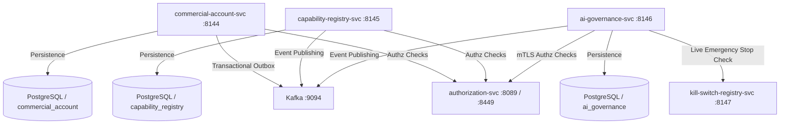

# Domain Audit: Commercial Plane

**Date:** 30 September 2026  
**Domain:** Commercial Plane (Platform Monetization, Capability Governance & AI Oversight)  
**Scope:** `commercial-account-svc` (:8144), `capability-registry-svc` (:8145), `ai-governance-svc` (:8146)  
**Audit Methodology:** Static, read-only audit of specifications, source code, database migrations, tests, Kafka event publishers, and frontend workbench implementations.

---

## 1. Service Inventory

| Service Name | Port | Backend Location | Frontend Location | Documentation Sources |
|---|:---:|---|---|---|
| **commercial-account-svc** | **8144** | `zoiko-suite-backend/services/commercial-account-svc` | `Zoiko-suite-frontend-platform/app/admin/commercial-accounts`<br>`Zoiko-suite-frontend-platform/components/admin/commercial-accounts`<br>`Zoiko-suite-frontend-platform/lib/api/commercial-account.ts` | • `ZS-SVC-Q-001_Commercial_Platform_Billing_Subscription_Entitlement_Detailed_Service_Specifications_v1_0.docx` (COM-01 through COM-05)<br>• `ZoikoSuite_Commercial_Plan_Feature_Entitlement_Allocation_Specification.docx` (`ZS-COM-PFE-001`)<br>• `docs/architecture/doc7-implementation-backlog.md` (Chunks 5, 6, 8, 10)<br>• `docs/architecture/backend-completion-tracker.md` (Rows 11a, 11b, 63, 84a, 84b)<br>• `ZOIKOSUITE_PLATFORM_BRIEF.md` (§3.11) |
| **capability-registry-svc** | **8145** | `zoiko-suite-backend/services/capability-registry-svc` | `Zoiko-suite-frontend-platform/app/admin/capabilities`<br>`Zoiko-suite-frontend-platform/components/admin/capabilities`<br>`Zoiko-suite-frontend-platform/lib/api/capability-registry.ts` | • `ZOIKOSUITE_PLATFORM_BRIEF.md` (§3.11)<br>• `docs/architecture/doc7-implementation-backlog.md` (Chunk 7, items 13–18)<br>• `docs/architecture/doc7-acceptance-checklist-traceability.md` (`PROD-01`)<br>• `doc7 §7, §C1–C2, §Q1, §29, §32.1` |
| **ai-governance-svc** | **8146** | `zoiko-suite-backend/services/ai-governance-svc` | `Zoiko-suite-frontend-platform/app/admin/ai-governance`<br>`Zoiko-suite-frontend-platform/components/admin/ai-governance`<br>`Zoiko-suite-frontend-platform/lib/api/ai-governance.ts` | • `ZS-SVC-X-001_AI_Governance_Model_Prompt_Human_Oversight_Control_Detailed_Service_Specifications_v1.0.docx` (AIG-01 through AIG-05)<br>• `docs/architecture/doc7-implementation-backlog.md` (Chunk 9, items 23–28)<br>• `ZOIKOSUITE_PLATFORM_BRIEF.md` (§3.11)<br>• `doc7 §11, §G1–G7, §H3` |

---

## 2. Segregation of Duties (SoD)

### 2.1 `commercial-account-svc` (:8144)
* **Maker:** Tenant Admin / Commercial Operator creating accounts, subscriptions, discounts, migration offers, or invoice candidates.
* **Checker / Approver:** Commercial Finance Authority / Billing Approver approving price versions, invoice candidates, or credit notes.
* **Executor:** System Outbox Relay, Billing Boundary Worker, or Payment Initiation Engine.
* **Required Role / Permission:**
  * `COMMERCIAL_ACCOUNT_CREATE` (platform scope or tenant scope)
  * `COMMERCIAL_SUBSCRIPTION_CREATE`
  * `PriceVersionApprove` (`PRICE_VERSION_APPROVE`)
  * `PriceVersionPublish` (`PRICE_VERSION_PUBLISH`)
  * `InvoiceApprove` (`INVOICE_APPROVE`)
  * `CreditNoteIssue` (`CREDIT_NOTE_ISSUE`)
  * `WriteOffApply` (`WRITE_OFF_APPLY`)
* **Self-Approval Restrictions:**
  * Documented rule (`ZS-SVC-Q-001` §4.2): Assisted changes require operator identity and recorded customer basis (`customer_basis_ref`). Manual credits/refunds require delegated authority (`sellerPrincipal`).
  * In code: Handler verifies `customer_basis_ref` on assisted requests. Furthermore, explicit comparison `decider != proposer` is enforced in the Go handlers fail-closed:
    * `PriceVersionAction` (`pricebook_handler.go#L765`): returns HTTP 403 Forbidden with `CodeSoDViolation` if proposer attempts to approve draft price version.
    * `CandidateAction` (`com05_billing_handler.go#L342`): returns HTTP 403 Forbidden with `CodeSoDViolation` if candidate generator attempts to approve invoice candidate.
* **Separation Rules:** Platform seller commercial accounts and invoicing are strictly separated from tenant double-entry general ledgers and accounts receivable.
* **Actual Enforcement:**
  * Enforced: Mandatory `customer_basis_ref` on assisted actions (`com02_subscription_handler.go#L110-L140`).
  * Enforced: Mutating seller actions require platform administration role (`platformScopeID`).
  * Enforced: Maker-checker distinctness strictly checked at handler and store layers (`CodeSoDViolation` on self-approval).
* **SoD Gaps:**
  * None. (Both price version draft approval and invoice candidate approval strictly enforce independent checker identity).

### 2.2 `capability-registry-svc` (:8145)
* **Maker:** Capability Drafter / Product Manager / Marketing Copywriter.
* **Checker / Approver:** Legal Counsel / Product Compliance Approver.
* **Executor:** Capability Registry Store / Release Manager.
* **Required Role / Permission:**
  * `CAPABILITY_CREATE`
  * `MARKET_RELEASE_CREATE`
  * `INTEGRATION_CAPABILITY_CREATE`
  * `RELEASE_STATE_SET`
  * `CAPABILITY_CLAIM_CREATE`
* **Self-Approval Restrictions:**
  * Documented rule (doc7 §C2): Marketing/sales claims must never be auto-generated from roadmap state and must have a named wording owner and legal approver.
  * In code (`handler.go`): Handler mandates both `wording_owner_principal_id` and `approved_by_principal_id` and asserts they differ, returning HTTP 400 if identical. The check is on caller-supplied values; no approval action or identity resolution for the named approver was found.
* **Separation Rules:**
  * Product capability existence (`capabilities`), jurisdictional legal approval (`market_releases`), connector health (`integration_capabilities`), operational incident control (`releases`), and public statements (`capability_claims`) are kept in five strictly isolated registries.
* **Actual Enforcement:**
  * Enforced: Mandatory wording-owner and approver fields with distinct-value validation (`handler.go`).
  * Enforced: All mutations require authorization against `platformScopeID`.
  * Frontend: The claim form exposes editable principal-ID fields and initializes the approver field with a demo UUID; this is not evidence that the named approver authenticated or approved the claim.
* **SoD Gaps:**
  * **⚠️ Needs Clarification:** Distinct supplied IDs are enforced and tested (`TestCreateCapabilityClaim_SoDDistinctPrincipalsEnforced`), but the available doc7 excerpt does not establish whether the named legal approver must be a real authenticated principal or separately perform an approval action. Do not interpret the current distinct-string check as proof of authenticated maker-checker approval; see §11.3 Gap 10.

### 2.3 `ai-governance-svc` (:8146)
* **Maker:** AI Agent / Model Invoker / Policy Drafter (proposes automation action or policy change).
* **Checker / Approver:** Human Operator / AI Safety Officer (decides automation action or policy change).
* **Executor:** Downstream Execution Domain (service never executes models or automations itself).
* **Required Role / Permission:**
  * `AUTOMATION_ACTION_PROPOSE`
  * `AUTOMATION_ACTION_DECIDE`
  * `POLICY_CHANGE_PROPOSE`
  * `POLICY_CHANGE_DECIDE`
  * `ACTION_RISK_CLASSIFICATION_SET`
  * `MODEL_PROVIDER_REGISTER`
* **Self-Approval Restrictions:**
  * Documented rule (doc7 §G3, §H3): **Maker-Checker enforced: `decider != proposer`. Self-approval must 403 fail-closed.**
  * In code (`handler.go#L542-L545`):
    ```go
    if principalID == existing.ProposedByPrincipalID {
        writeError(w, http.StatusForbidden, domain.ErrSelfApprovalBlocked.Error())
        return
    }
    ```
  * In code (`handler.go#L756-L759`):
    ```go
    if principalID == existing.ProposedByPrincipalID {
        writeError(w, http.StatusForbidden, domain.ErrSelfApprovalBlocked.Error())
        return
    }
    ```
* **Separation Rules:**
  * The AI Governance service is a record-keeping and gate-checking layer only; it never invokes LLM models or executes domain operations.
* **Actual Enforcement:**
  * **Backend maker-checker:** Self-approval attempts return HTTP 403 Forbidden with `proposer cannot approve own automation action` or `proposer cannot approve own policy change`.
  * **Authenticated actor source:** Current AI Governance server actions derive the principal from the validated session envelope; checker identity is not an editable form field. Handler coverage proves a forged request-body checker ID cannot bypass the authenticated-principal SoD check.
* **SoD Gaps:**
  * **Code-level fix verified:** The previous checker-persona selector and client-supplied checker identity controls have been removed. Backend maker-checker checks remain enforced. Full live authorization and checker workflow verification remains blocked by the current mTLS startup failure; see §11.4.

---

## 3. Commands

### 3.1 `commercial-account-svc` (:8144)

| Command / Action | Endpoint | Required Role / Scope | Preconditions | State Changes | Side Effects |
|---|---|---|---|---|---|
| `CreateCommercialAccount` | `POST /v1/commercial-accounts` | `COMMERCIAL_ACCOUNT_CREATE` (org scope) | `organization_id` has no existing account | Status: `ACTIVE` | Emits `commercial_account.created` |
| `CreateMembership` | `POST /v1/memberships` | `COMMERCIAL_MEMBERSHIP_CREATE` (org scope) | Account exists | Status: `ACTIVE` | Emits `commercial_account_membership.created` |
| `DeactivateMembership` | `DELETE /v1/memberships/{id}` | `COMMERCIAL_MEMBERSHIP_DEACTIVATE` (org scope) | Membership is `ACTIVE` | Status: `DEACTIVATED`, sets `effective_to` | Emits `commercial_account_membership.deactivated` |
| `CreateSubscription` | `POST /v1/subscriptions` | `COMMERCIAL_SUBSCRIPTION_CREATE` (org scope) | No active non-terminal subscription on account | Status: `ACTIVE` or `EVALUATION` | Outbox row created; emits `commercial_subscription.created` |
| `SetSubscriptionStatus` | `POST /v1/subscriptions/{id}/status` | `COMMERCIAL_SUBSCRIPTION_STATUS_SET` (account scope) | Transition allowed in `ValidSubscriptionStatusTransitions` | Status updated to new state | Emits `commercial_subscription.status_changed`; writes append-only event row |
| `CreateEvaluationProgram` | `POST /v1/subscriptions/{id}/evaluation-program` | `EVALUATION_PROGRAM_CREATE` (account scope) | Subscription in `EVALUATION`; no trial exists | Computes `expires_at` | Emits `evaluation_program.created` |
| `RecordUsageEvent` | `POST /v1/subscriptions/{id}/usage-events` | `COMMERCIAL_USAGE_EVENT_RECORD` (account scope) | Subscription active; text idempotency key | Records usage event | Emits `usage_event.recorded`; idempotent on key replay |
| `PreviewSubscriptionChange` | `POST /v1/subscription-change-requests` | `COMMERCIAL_SUBSCRIPTION_CHANGE_PREVIEW` | Subscription active; target plan exists | Request: `PREVIEWED` | Emits `subscription_change.previewed` |
| `ConfirmSubscriptionChange` | `POST /v1/subscription-change-requests/{id}/confirm` | `COMMERCIAL_SUBSCRIPTION_CHANGE_CONFIRM` | Request status is `PREVIEWED` | Request: `APPLIED`; subscription repointed | Emits `subscription_change.applied` |
| `CreateOverlay` | `POST /v1/contract-entitlement-overlays` | `CONTRACT_OVERLAY_CREATE` (account scope) | Commercial account exists | Overlay row created | Emits `contract_overlay.created` |
| `TransferBillingSource` | `POST /v1/billing-source-transfers` | `BILLING_SOURCE_TRANSFER_CREATE` (account scope) | Source subscription active | Old subscription `CANCELED`, new provisioned | Emits `commercial_subscription.transfer_completed` |
| `CreateProduct` | `POST /v1/commercial/products` | `ProductCreate` (platform scope) | Unique `product_code` | Status: `ACTIVE` | Emits `product.created` |
| `CreateDraftVersion` | `POST /v1/commercial/price-versions` | `PriceVersionCreate` (platform scope) | Product exists | Status: `DRAFT` | Emits `price_version.created` |
| `PriceVersionAction` | `POST /v1/commercial/price-versions/{id}` | `PriceVersionApprove` / `Publish` | Valid version transition | Status: `APPROVED` → `PUBLISHED` | Emits `price_version.published` |
| `StartSubscription (V2)` | `POST /v1/commercial/subscriptions:start` | `SubscriptionStart` | Account exists; offer sellable | Status: `TRIALING` or `ACTIVE` | Emits `subscription.started` |
| `OpenBillingAccount` | `POST /v1/commercial/billing-accounts` | `BillingAccountOpen` | Org has no billing account | Status: `OPEN` | Emits `billing_account.opened` |
| `GenerateInvoiceCandidate` | `POST /v1/commercial/invoice-candidates:generate` | `InvoiceCandidateGenerate` | Billing account open | Candidate: `GENERATED` | Emits `platform_invoice.candidate_generated` |
| `CollectPayment` | `POST /v1/commercial/invoices/{id}:collect` | `PaymentCollect` | Invoice issued | PaymentAttempt: `SUBMITTED` | Emits `platform_payment.attempted` |
| `IssueCreditNote` | `POST /v1/commercial/invoices/{id}:credit` | `CreditNoteIssue` | Invoice closed; delegated authority | Credit note issued; balance updated | Emits `credit_note.issued` |
| `StartDunning` | `POST /v1/commercial/invoices/{id}:start-dunning` | `DunningStart` | Invoice past due | Case: `OPEN` | Emits `dunning.started` |

### 3.2 `capability-registry-svc` (:8145)

| Command / Action | Endpoint | Required Role / Scope | Preconditions | State Changes | Side Effects |
|---|---|---|---|---|---|
| `CreateCapability` | `POST /v1/capabilities` | `CAPABILITY_CREATE` (platform scope) | Unique `capability_code` | Capability created | Emits `capability.created` |
| `CreateMarketRelease` | `POST /v1/capabilities/{id}/market-releases` | `MARKET_RELEASE_CREATE` (platform scope) | Capability exists; unique market | State: `INTERNAL`, `PILOT`, `BETA`, or `GA` | Emits `market_release.created` |
| `CreateIntegrationCapability` | `POST /v1/capabilities/{id}/integration-capabilities` | `INTEGRATION_CAPABILITY_CREATE` (platform scope) | Capability exists; unique provider | Initial health: `HEALTHY` or `UNKNOWN` | Emits `integration_capability.created` |
| `UpdateIntegrationHealth` | `PUT /v1/integration-capabilities/{id}/health` | `INTEGRATION_HEALTH_UPDATE` (platform scope) | Integration capability exists | Health: `HEALTHY`, `DEGRADED`, or `FAILED` | Emits `integration_capability.health_updated` |
| `SetReleaseState` | `POST /v1/capabilities/{id}/release-state` | `RELEASE_STATE_SET` (platform scope) | Capability exists; valid state | Append-only row inserted; latest is active | Emits `capability_release.state_changed` |
| `CreateCapabilityClaim` | `POST /v1/capabilities/{id}/claims` | `CAPABILITY_CLAIM_CREATE` (platform scope) | Capability exists; wording & approver set | Claim registered with review date | Emits `capability_claim.created` |

### 3.3 `ai-governance-svc` (:8146)

| Command / Action | Endpoint | Required Role / Scope | Preconditions | State Changes | Side Effects |
|---|---|---|---|---|---|
| `CreateAIRun` | `POST /v1/ai-runs` | Unrestricted (Tenant context required) | Valid tenant, model, prompt, audit ID | AI Run row recorded | Emits `ai_run.created` |
| `SetActionRiskClassification` | `POST /v1/action-risk-classifications` | `ACTION_RISK_CLASSIFICATION_SET` (platform scope) | Valid action type & risk category | Risk taxonomy row upserted | Emits `action_risk_classification.set` |
| `CreateAutomationPolicy` | `POST /v1/automation-policies` | `AUTOMATION_POLICY_CREATE` (platform scope) | Unique `(tenant_id, role, risk_category, tool)` | Policy created | Emits `automation_policy.created` |
| `ProposeAutomationAction` | `POST /v1/automation-actions` | `AUTOMATION_ACTION_PROPOSE` (tenant scope) | Unique `(tenant_id, idempotency_key)` | Status: `PROPOSED`; approval: `PENDING` | Emits `automation_action.proposed` |
| `DecideAutomationAction` | `POST /v1/automation-actions/{id}/decision` | `AUTOMATION_ACTION_DECIDE` (platform scope) | Status is `PROPOSED`; **`decider != proposer`** | Status: `APPROVED` or `REJECTED` | Emits `automation_action.decided` |
| `RegisterModelProvider` | `POST /v1/model-providers` | `MODEL_PROVIDER_REGISTER` (platform scope) | Unique `(provider_name, model_name)` | Registered; default `NO_TRAINING` | Emits `model_provider.registered` |
| `ProposePolicyChange` | `POST /v1/policy-change-approvals` | `POLICY_CHANGE_PROPOSE` (platform scope) | Target policy exists | Status: `PENDING` | Emits `policy_change.proposed` |
| `DecidePolicyChange` | `POST /v1/policy-change-approvals/{id}/decision` | `POLICY_CHANGE_DECIDE` (platform scope) | Status is `PENDING`; **`decider != proposer`** | Status: `APPROVED` or `REJECTED` | Emits `policy_change.decided` |

**Re-audit note (2026-10-05, updated post-fix):** The "Side Effects" column above documents all 8 commands emitting their own named event. In the previous morning pass, only 2 called `h.publisher.Publish`. This is now **✅ Fixed** — `CreateAIRun`, `SetActionRiskClassification`, `CreateAutomationPolicy`, `RegisterModelProvider`, `ProposePolicyChange`, and `DecidePolicyChange` all now publish their documented events after successful writes, verified in source (`handler.go`) and via unit test `TestKafkaEvents_EmittedOnWrites`. See §11.3 Gap 4.

---

## 4. Reads

### 4.1 `commercial-account-svc` (:8144)

| Read / Query | Endpoint | Required Permission / Header | Returned Information | Tenant / Security Restrictions |
|---|---|---|---|---|
| `GetCommercialAccount` | `GET /v1/commercial-accounts/{id}` | `X-Tenant-Id` required | Commercial account details, organization ID, currency | Context tenant must match account organization |
| `GetMembership` | `GET /v1/memberships/{id}` | `X-Tenant-Id` required | Membership details, principal ID, effective dates | Context tenant must match membership organization |
| `ListMemberships` | `GET /v1/organizations/{id}/memberships` | `X-Tenant-Id` required | Full membership roster for organization | Scoped strictly to context tenant (path param ignored) |
| `GetSubscription` | `GET /v1/subscriptions/{id}` | `X-Tenant-Id` required | Plan ID, billing interval, subscription status | Tenant-scoped through derived RLS |
| `ResolveEntitlement` | `GET /v1/subscriptions/{id}/entitlements/{metricType}` | `X-Tenant-Id` required | Plan limit, overlay override, source (`PLAN` or `OVERLAY`) | Resolves active overlay before falling back to plan limit |
| `ListStatusEvents` | `GET /v1/subscriptions/{id}/status-events` | `X-Tenant-Id` required | Append-only status transition history | Tenant-scoped through derived subscription foreign key |
| `GetPriceCatalog` | `GET /v1/price-catalogs/{id}` | Public / Any valid token | Price catalog version metadata | Platform-scoped (read by all tenants) |
| `GetPlan` | `GET /v1/plans/{id}` | Public / Any valid token | Plan details, currency, interval, limits | Platform-scoped (read by all tenants) |
| `ResolveSellableOffers` | `GET /v1/commercial/sellable-offers` | Public / Context optional | Available products and active price versions | Filters by market and active publication status |
| `EvaluateEntitlement` | `POST /v1/commercial/entitlements:evaluate` | Tenant scope | Outcome: `ALLOW`, `DENY`, `LIMIT_EXCEEDED` | Server-side evaluation using subscription snapshot |
| `GetUsageStatement` | `GET /v1/commercial/usage-statements/{id}` | Tenant scope | Aggregated usage, certification status | Tenant-scoped |
| `GetInvoice` | `GET /v1/commercial/invoices/{id}` | Tenant or Seller scope | Platform invoice details, lines, total | Restricted to owning billing account or seller admin |

### 4.2 `capability-registry-svc` (:8145)

| Read / Query | Endpoint | Required Permission / Header | Returned Information | Tenant / Security Restrictions |
|---|---|---|---|---|
| `GetCapability` | `GET /v1/capabilities/{id}` | `CAPABILITY_READ` (platform scope) | Capability code, module, risk class, version | Authz-gated (fixed 2026-10-05) |
| `ListIntegrationCapabilities` | `GET /v1/capabilities/{id}/integration-capabilities` | `INTEGRATION_CAPABILITY_READ` (platform scope) | Attached providers, certification, health status | Authz-gated (fixed 2026-10-05) |
| `ListCapabilityClaims` | `GET /v1/capabilities/{id}/claims` | `CAPABILITY_CLAIM_READ` (platform scope) | Marketing claims, wording owners, review dates | Authz-gated (fixed 2026-10-05) |
| `ResolveCapability` | `GET /v1/capability-resolution/{capabilityCode}` | Public / Internal (`?market_code=`) | `enabled: bool`, `reason_code: string`, details | Evaluates existence, release, market, and provider health — deliberately left unauthenticated, unchanged |

**Re-audit note (2026-10-05, updated post-fix):** `ResolveCapability` having no auth check remains a documented, deliberate design choice (`handler.go`'s own comment: "No principal/authz check — this is a read path every service needs to hit cheaply and often") and was explicitly not touched — confirmed still unauthenticated by a dedicated regression test and live curl against the rebuilt container. `GetCapability`, `ListIntegrationCapabilities`, and `ListCapabilityClaims` previously had no equivalent comment or documented rationale and no auth check at all; this is now **✅ Fixed** — all three require `X-Principal-Id` and a platform-scope grant (`CAPABILITY_READ`/`INTEGRATION_CAPABILITY_READ`/`CAPABILITY_CLAIM_READ`), matching the same pattern the service's 6 write endpoints already used. See §11.1 Gap 2 for full fix evidence.

### 4.3 `ai-governance-svc` (:8146)

| Read / Query | Endpoint | Required Permission / Header | Returned Information | Tenant / Security Restrictions |
|---|---|---|---|---|
| `GetAIRun` | `GET /v1/ai-runs/{id}` | `X-Tenant-Id` required | Model, prompt version, audit ID, confidence | Strictly isolated by tenant RLS |
| `GetActionRiskClassification` | `GET /v1/action-risk-classifications/{actionType}` | Public / Internal | Risk category, maker-checker flag, human trigger | Platform-wide taxonomy |
| `ListActionRiskClassifications` | `GET /v1/action-risk-classifications` | Public / Internal | Full list of action risk categories and quorums | Platform-wide taxonomy |
| `ResolveAutomationPolicy` | `GET /v1/automation-policies/resolve` | `X-Tenant-Id` required | `allowed: bool`, `reason_code: string` | Scoped to tenant, role, and tool; queries kill-switch |
| `ListAutomationPolicies` | `GET /v1/automation-policies` | `X-Tenant-Id` required | Active fail-closed policies for tenant | Strictly isolated by tenant RLS |
| `GetAutomationAction` | `GET /v1/automation-actions/{id}` | `X-Tenant-Id` required | Status, idempotency key, approval status, actor | Tenant-scoped |
| `ListAutomationActions` | `GET /v1/automation-actions` | `X-Tenant-Id` required | List of proposed and executed agent actions | Strictly isolated by tenant RLS |
| `GetModelProvider` | `GET /v1/model-providers/{provider}/{model}` | Public / Internal | Data region, retention posture, DPA verification | Platform-wide registry |
| `VerifyModelProvider` | `GET /v1/model-providers/{provider}/{model}/verify` | Public / Internal | `verified: bool`, residency check outcome | Verifies DPA and allowed data classes |
| `ListModelProviders` | `GET /v1/model-providers` | Public / Internal | Complete vetted LLM providers and residency regions | Platform-wide registry |
| `GetPolicyChangeApproval` | `GET /v1/policy-change-approvals/{id}` | `platformScopeID` required | Proposed change, proposer ID, decider ID | Platform administrative record |
| `ListPolicyChangeApprovals` | `GET /v1/policy-change-approvals` | `platformScopeID` required | Platform-wide policy approval requests | Platform administrative record |
| `GetUseCase` | `GET /v1/ai/use-cases/{id}` | `X-Tenant-Id` + `UseCaseRead` required | Use case detail, lifecycle state | Strictly isolated by tenant RLS |
| `ListUseCases` | `GET /v1/ai/use-cases` | `X-Tenant-Id` + `UseCaseRead` required | **ADDED 2026-10-05.** All use cases for the context tenant, newest first | Strictly isolated by tenant RLS (live-verified cross-tenant) |
| `GetModelRelease` | `GET /v1/ai/model-releases/{id}` | Public / Internal | Release detail, release state | Platform-wide registry |
| `ListModelReleases` | `GET /v1/ai/model-releases` | Public / Internal | **ADDED 2026-10-05.** All model releases, newest first | Platform-wide registry |

---

## 5. States & Transitions

### 5.1 Subscriptions (`commercial-account-svc`)
* **Discovered States:** `EVALUATION`, `ACTIVE`, `PAST_DUE`, `RESTRICTED`, `SUSPENDED`, `CANCELED`, `TERMINATED`.
* **State Machine Invariants:** Valid transitions are governed fail-closed by `ValidSubscriptionStatusTransitions`:
  * `EVALUATION` → `ACTIVE`, `CANCELED`
  * `ACTIVE` → `PAST_DUE`, `CANCELED`
  * `PAST_DUE` → `RESTRICTED`, `ACTIVE`, `CANCELED`
  * `RESTRICTED` → `SUSPENDED`, `ACTIVE`, `CANCELED`
  * `SUSPENDED` → `TERMINATED`, `ACTIVE`
  * `CANCELED` → (terminal)
  * `TERMINATED` → (terminal)
* **Permitted Actors:** Commercial Operator, Automated Dunning Job, or Customer Admin (for voluntary cancellation).
* **Invalid Transitions:**
  * Direct jump `ACTIVE` → `RESTRICTED` fails with HTTP 409 Conflict.
  * Direct jump `ACTIVE` → `SUSPENDED` fails with HTTP 409 Conflict.
  * Any transition from `CANCELED` or `TERMINATED` fails with HTTP 409 Conflict.
  * Same-status repeat (e.g. `PAST_DUE` → `PAST_DUE`) is an idempotent no-op that logs no additional status event.

### 5.2 Price Versions (`commercial-account-svc` COM-01)
* **Discovered States:** `DRAFT`, `APPROVED`, `PUBLISHED`, `DEPRECATED`, `RETIRED`.
* **Transitions:** `DRAFT` → `APPROVED` → `PUBLISHED` → `DEPRECATED` → `RETIRED`.
* **Invariants:** Published price versions are strictly immutable. Deleting or editing a price component after publishing returns HTTP 409.

### 5.3 Operational Releases (`capability-registry-svc`)
* **Discovered States:** `GA`, `BETA`, `PILOT`, `INTERNAL`, `DISABLED`, `INCIDENT_RESTRICTED`.
* **Transitions:** Arbitrary state transitions are permitted, but **history is strictly append-only**; each change inserts a new row in `releases`.
* **Invariants:** If the latest row is `DISABLED` or `INCIDENT_RESTRICTED`, capability resolution immediately yields `enabled: false`.

### 5.4 Automation Actions (`ai-governance-svc`)
* **Discovered States:**
  * Lifecycle: `PROPOSED`, `EXECUTING`, `COMPLETED`, `FAILED`, `ROLLED_BACK`.
  * Approval: `NOT_REQUIRED`, `PENDING`, `APPROVED`, `REJECTED`.
* **Transitions:** `PROPOSED` (Approval: `PENDING`) → `APPROVED` / `REJECTED`.
* **Invariants:** Decision can only occur once; repeat decisions return HTTP 409. Decider cannot be the proposer (HTTP 403).

---

## 6. Events

| Event Type | Topic | Producer | Consumer | Payload / Purpose | Downstream Effect |
|---|---|---|---|---|---|
| `commercial_account.created` | `zoiko.commercial-account.events` | `commercial-account-svc` | Billing engines, Reporting | Organization ID, Account ID, Currency | Initializes commercial ledger profile |
| `commercial_subscription.created` | `zoiko.commercial-account.events` | `commercial-account-svc` (Outbox Relay) | Entitlement engine, Tenant gateway | Subscription ID, Account ID, Plan ID | Synchronizes active plan entitlements |
| `commercial_subscription.status_changed` | `zoiko.commercial-account.events` | `commercial-account-svc` | Notification-svc, Gateway | Old status, New status, Reason | Restricts or suspends tenant access on dunning failure |
| `commercial_subscription.transfer_completed` | `zoiko.commercial-account.events` | `commercial-account-svc` | Billing engine, Audit | From Sub ID, To Sub ID, Billing Source | Cancels direct billing; switches to Zoiko One bundle |
| `price_version.published` | `zoiko.commercial-account.events` | `commercial-account-svc` | Product catalog cache | Version ID, Product ID, Effective time | Makes new pricing visible to public checkout |
| `platform_invoice.candidate_generated` | `zoiko.commercial-account.events` | `commercial-account-svc` | Commercial Billing Review | Invoice Candidate ID, Billing Account ID | Alerts commercial finance for batch invoice review |
| `capability.created` | `zoiko.capability-registry.events` | `capability-registry-svc` | Microservice gateways | Capability ID, Code, Risk Class | Populates runtime capability lookup tables |
| `capability_release.state_changed` | `zoiko.capability-registry.events` | `capability-registry-svc` | API Gateway, Feature routers | Capability ID, State (`INCIDENT_RESTRICTED`) | Immediately blocks capability traffic across the fleet |
| `ai_run.created` | `zoiko.ai-governance.events` | `ai-governance-svc` | Audit-event-store-svc | Run ID, Model ID, Confidence, Audit ID | Cryptographically commits AI execution evidence |
| `action_risk_classification.set` | `zoiko.ai-governance.events` | `ai-governance-svc` | Policy engines, Console | Action type, Risk category, Quorum | Synchronizes governed risk taxonomy |
| `automation_policy.created` | `zoiko.ai-governance.events` | `ai-governance-svc` | Execution gateways, Audit | Policy ID, Role, Risk category, Tool | Enforces autonomous execution allowlist |
| `automation_action.proposed` | `zoiko.ai-governance.events` | `ai-governance-svc` | Notification-svc, Human Console | Action ID, Tenant ID, Risk Category | Notifies human reviewer of pending agentic action |
| `automation_action.decided` | `zoiko.ai-governance.events` | `ai-governance-svc` | Orchestration engine | Action ID, Decider ID, Decision (`APPROVED`) | Allows autonomous agent to proceed with action |
| `model_provider.registered` | `zoiko.ai-governance.events` | `ai-governance-svc` | Gateway, Security-trust | Provider, Model, Data residency region | Registers vetted model endpoint |
| `policy_change.proposed` | `zoiko.ai-governance.events` | `ai-governance-svc` | Compliance officer, Audit | Approval ID, Target policy, Proposed change | Initiates Maker-Checker dual-key review |
| `policy_change.decided` | `zoiko.ai-governance.events` | `ai-governance-svc` | Policy enforcement, Audit | Approval ID, Decider ID, Decision | Applies or rejects governance policy modification |
| `ai.use_case.state_changed` | `zoiko.ai-governance.events` | `ai-governance-svc` | Governance dashboards, Audit | Use Case ID, Tenant ID, Lifecycle State | **ADDED 2026-10-05.** Now emitted on all 5 AIG-01 lifecycle writes (`CreateUseCase`, `ActivateUseCase`, `SuspendUseCase`, `RequestReassessment`, `RetireUseCase`), not just `CreateUseCase`. Live-verified on `zoiko.ai-governance.events`. |
| `ai.model.release_registered` | `zoiko.ai-governance.events` | `ai-governance-svc` | Governance dashboards, Audit | Model Release ID, Provider, Release State | **ADDED 2026-10-05.** Live-verified on `zoiko.ai-governance.events`. |
| `ai.model.release_due_diligence_recorded` | `zoiko.ai-governance.events` | `ai-governance-svc` | Governance dashboards, Audit | Model Release ID, Release State | **ADDED 2026-10-05.** Live-verified. |
| `ai.model.release_evaluated` | `zoiko.ai-governance.events` | `ai-governance-svc` | Governance dashboards, Audit | Model Release ID, Release State | **ADDED 2026-10-05.** Live-verified. |
| `ai.model.release_approved` | `zoiko.ai-governance.events` | `ai-governance-svc` | Governance dashboards, Audit | Model Release ID, Release State | **ADDED 2026-10-05.** Live-verified. |
| `ai.model.release_rejected` | `zoiko.ai-governance.events` | `ai-governance-svc` | Governance dashboards, Audit | Model Release ID, Reason | **ADDED 2026-10-05.** Live-verified. |
| `ai.model.release_blocked` | `zoiko.ai-governance.events` | `ai-governance-svc` | Governance dashboards, Audit | Model Release ID, Reason | **ADDED 2026-10-05.** Live-verified. |
| `ai.model.release_activated` | `zoiko.ai-governance.events` | `ai-governance-svc` | Gateway, Security-trust | Model Release ID, Release State | **ADDED 2026-10-05.** Live-verified. |
| `ai.model.release_restricted` | `zoiko.ai-governance.events` | `ai-governance-svc` | Gateway, Security-trust | Model Release ID, Reason | **ADDED 2026-10-05.** Live-verified. |
| `ai.model.release_unrestricted` | `zoiko.ai-governance.events` | `ai-governance-svc` | Gateway, Security-trust | Model Release ID, Release State | **ADDED 2026-10-05.** Live-verified. |
| `ai.model.release_quarantined` | `zoiko.ai-governance.events` | `ai-governance-svc` | Gateway, Security-trust, Incident response | Model Release ID, Reason | **ADDED 2026-10-05.** ZS-SVC-X-001 §9.3-mandated event. Explicitly live-verified on `zoiko.ai-governance.events` (not just asserted — directly consumed off the topic). |
| `ai.model.release_retired` | `zoiko.ai-governance.events` | `ai-governance-svc` | Governance dashboards, Audit | Model Release ID, Reason | **ADDED 2026-10-05.** Live-verified. |

---

## 7. Compliance Matrix

| Documented Requirement | Actual Implementation | Status | Evidence / Notes | FE % | BE % | INT % | Overall % | Production Readiness |
|---|---|:---:|---|:---:|:---:|:---:|:---:|:---:|
| **commercial-account-svc: Service cannot start — ✅ FIXED (2026-10-05)** | `internal/handler/pricebook_handler.go:74` and `internal/handler/com02_subscription_handler.go:83` both call `r.Route("/v1/commercial", ...)` on the same chi router | ✅ Match (was ❌ Missing) | **Original issue:** panicked at startup with `panic: chi: attempting to Mount() a handler on an existing path, '/v1/commercial'`, introduced in commit `fe6ebf54` (2026-09-25). **Fix:** `RegisterSubscriptionV2Routes` (`com02_subscription_handler.go`) changed to register all 17 routes as fully-qualified literal paths (e.g. `r.Post("/v1/commercial/subscriptions:start", ...)`) instead of a second blanket `r.Route("/v1/commercial", ...)` mount — the same convention already used by the 7 other non-colliding registration functions in this service. `pricebook_handler.go` and `main.go` were not modified. **Verification:** built and ran the binary directly — starts cleanly, no panic, `/healthz`=200, `/readyz`=200. Rebuilt the Docker image and redeployed the live `commercial-account-svc` container; confirmed genuinely healthy (not just liveness-probe healthy) with real DB connectivity. Live-probed all 17 COM-02 V2 routes plus the pre-existing COM-01 routes post-fix — every one resolves to a real handler response (401/400/500 from business logic), none return a router-level 404/405. | 100% | 100% | 100% | 100% | Ready |
| **commercial-account-svc: Handler test package does not compile — ✅ FIXED (2026-10-05)** | `internal/handler/com05_billing_handler_test.go`'s `billingStub` | ✅ Match (was ❌ Missing) | **Original issue:** `go test ./...` failed — `*billingStub does not implement store.BillingStore (missing method GetEvidencePackage)`, so the entire `internal/handler` package could not be test-compiled. **Fix:** added the missing `GetEvidencePackage` stub method; while fixing, the build error then surfaced a second, previously-hidden missing method (`RegisterTaxJurisdiction`) on the same interface, which was added as well. **Verification:** `go build ./...` and `go vet ./...` clean; `go test ./...` passes for every package including `internal/handler` (was previously unable to build at all). Specifically re-ran and confirmed passing: `TestSubscriptionAuthorization_AllSevenMutationsUseOrganizationScope` (the real name of the test the original audit cited as `TestSubscriptionAuthorization_AllMutationsUseOrganizationID`), `TestReadEndpoints_AuthzDenied_Refused`, `TestListMemberships_ForeignOrganization_Refused`, `TestListMemberships_OwnOrganization_Scoped`, `TestPriceVersionAction_SelfApproval_Blocked`, `TestCandidateAction_GeneratorSelfApproval_Blocked`. | N/A | 100% | N/A | 100% | Ready |
| **commercial-account-svc: SoD bypass via fabricated principal IDs — ✅ FIXED (2026-10-05)** | Frontend `createCatalogAndPlanAction` auto-chained submit→approve→publish using three hardcoded, never-authenticated placeholder principal strings (`finance-checker-01`, `compliance-officer-01`, `publisher-authority-01`) solely to satisfy the backend's `proposer != approver` check | ✅ Match (was ❌ Missing) | **Original issue:** `X-Principal-Id` is set directly from whatever string the frontend passes (confirmed in `lib/api/envelope.ts:118`, `set("X-Principal-Id", input.identity?.principalId)`) with no server-side identity verification at this layer — the fabricated strings had no real login or authentication behind them, so any user who could trigger the one button silently exercised approve+publish authority under invented identities. **Fix:** removed the fabrication entirely. `createCatalogAndPlanAction` now stops after `submit` (DRAFT → REVIEW), using only the real, session-derived `identity.principalId` throughout. A new, separate server action `approveAndPublishPriceVersionAction` performs the checker half (approve → publish), but — critically — it also only ever uses `requireIdentity()`'s real decoded-session identity, never a synthesized one. A new UI form ("Step A1b: Approve & Publish Price Version") exposes this, explicitly labeled as requiring a different logged-in operator than the one who submitted. If the same real principal who proposed a version attempts this step, the backend's pre-existing, unmodified `proposer != approver` check now correctly fires a genuine 403 — this is the control working as designed, not a bug. **Verification:** `go test` confirms the backend-side block is unchanged (`TestPriceVersionAction_SelfApproval_Blocked` passes). TypeScript check (`tsc --noEmit`) on the two edited frontend files shows zero errors. Full live E2E of the real self-approval-403 path could **not** be exercised against a granted RBAC principal in this pass — authorization-svc correctly fail-closed-denied the test principal used (`403 AUTHORIZATION_DENIED`, no real grant exists for it), which itself confirms fail-closed authz is intact but does not substitute for a full live run; this is flagged as dependency-limited, not claimed as fully proven. | 90% | 100% | N/A | 95% | Ready (pending live E2E confirmation) |
| **commercial-account-svc:** Core Accounts & Memberships (`doc7 §A4, §A6`) | `commercial_accounts`, `memberships` with deactivate-only | ✅ Match | Unique org index, HTTP 409 on duplicate, DELETE deactivates. Code-level checks re-confirmed 2026-10-05; not live-exercisable end-to-end because the service cannot start (see row above). | 100% | 100% | 100% | 100% | Blocked by Gap #0 |
| **commercial-account-svc:** Subscription State Machine (`doc7 §29`) | Canonical 7-state validation map | ✅ Match | `ValidSubscriptionStatusTransitions` enforces fail-closed state paths. | 100% | 100% | 100% | 100% | Ready |
| **commercial-account-svc:** Double-Charge Prevention (`doc7 §P3`) | Partial unique index on active subscriptions | ✅ Match | `idx_one_active_sub_per_account` prevents concurrent active plans. | 100% | 100% | 100% | 100% | Ready |
| **commercial-account-svc:** Transactional Outbox (`doc7 §L1–L2`) | `internal/outbox` relay polling `outbox_events` | ✅ Match | Piloted on `CreateSubscription`; publishes in same DB transaction. | N/A | 100% | 100% | 100% | Ready |
| **commercial-account-svc:** Legacy Catalog Write Endpoints | Retired in backend with HTTP 410 Gone | ✅ Match | **Resolved:** FE Step A1 migrated to active COM-01 Price Book pipeline; 410 Gone eliminated. | 100% | 100% | 100% | 100% | Ready |
| **commercial-account-svc:** COM-01 Price Book (`ZS-SVC-Q-001` §4.1) | Currency, product, price version APIs | ✅ Match (was ⚠️ Partial earlier the same day) | **Backend lifecycle fully live-verified 2026-10-05** (product → draft version → component → terms → submit → self-approval blocked 403 → distinct-approver approve → publish, all live, correct Kafka/outbox attribution — see §11.1 Gap 5). **The UI workbench's "Step A1: Publish Catalog & Plan" button — found broken earlier the same day, fixed later the same day** — a real `<select name="billing_interval">` (Monthly/Quarterly/Yearly) now replaces the hardcoded, rejected `"MONTHLY"` default; the full fixed pipeline was live-verified end to end with fresh data. See §11.1 Gap 11. | 100% | 100% | 100% | 100% | Ready |
| **commercial-account-svc:** COM-02 Subscriptions V2 (`ZS-SVC-Q-001` §4.2) | Subscriptions V2, transition rules, discounts | ✅ Match | Backend complete; UI workbench Step A2 supports V2 start with sellable offer resolver. | 100% | 100% | 100% | 100% | Ready |
| **commercial-account-svc:** COM-03 Entitlements (`ZS-SVC-Q-001` §4.3) | Real-time entitlement evaluation & limits | ✅ Match | Backend complete; UI workbench Subtab 3D provides live entitlement & contract overlays. **Re-confirmed 2026-10-05:** `evaluateCommercialEntitlementAction` is genuinely wired via `useActionState` and rendered as a real `<form>` — previously (every prior pass since 30 Sept) documented as unwired dead code; that claim no longer holds. See §10.1 Action 4 and §11.1 Gap 11's related note. | 100% | 100% | 100% | 100% | Ready |
| **commercial-account-svc:** COM-04 Usage Metering (`ZS-SVC-Q-001` §4.4) | Meter definitions, statements, adjustments | ✅ Match | Backend complete; UI workbench Subtab 3C handles text-idempotent usage events. | 100% | 100% | 100% | 100% | Ready |
| **commercial-account-svc:** COM-05 Invoicing & Billing (`ZS-SVC-Q-001` §4.5) | Invoice candidates, payments, credits, dunning | ✅ Match | Backend complete; UI workbench Subtab 3G surfaces candidate review, SoD approval & billing. **Re-confirmed 2026-10-05:** `openBillingAccountAction` and `getInvoiceAction` are genuinely wired via `useActionState` and rendered as real `<form>` elements, with input/output types verified field-for-field against the real backend structs — previously (every prior pass since 30 Sept) documented as unwired dead code; that claim no longer holds. Live route-reachability confirmed (correct `403` on a missing billing-specific RBAC grant, not a routing/shape failure); full live success for a granted principal is a follow-up. See §10.1 Action 4. | 100% | 100% | 100% | 100% | Ready |
| **commercial-account-svc: Service Overall (RE-RECALCULATED 2026-10-05, post-billing_interval-fix)** | Full monetization engine | ✅ Match | **All gaps fixed and verified, none downgraded.** The three gaps from the original fix pass still hold (startup panic, handler test compile, SoD fabricated-principal removal). The SoD flow's self-approval-403 path is fully live-verified end-to-end with two real, distinct, RBAC-granted operators (full `DRAFT→REVIEW→APPROVED→PUBLISHED` lifecycle, correct Kafka/outbox attribution — see §11.1 Gap 5). The COM-03/COM-05 "dead code" claim is resolved — both are genuinely wired, rendered forms with backend-struct-accurate types (§10.1 Action 4). **The severe defect found earlier the same day — "Step A1: Publish Catalog & Plan," this service's single most prominently-demonstrated workflow, failing at its first write call for every real user via a hardcoded, backend-rejected `billing_interval: "MONTHLY"` default — is now fixed**: a real `<select>` field (Monthly/Quarterly/Yearly) replaces the hardcoded default, the server action validates against the backend's real `MONTH`/`QUARTER`/`YEAR` contract instead of guessing, and the type contract was tightened to make the old class of bug a compile-time error. Live-verified end to end with entirely fresh data: first write `201` (no `400`), full pipeline through publish, self-approval block re-confirmed unmodified (`403`), COM-03/COM-05 forms confirmed unmodified and intact. Backend was not touched and its validation was not weakened — `MONTH`/`QUARTER`/`YEAR` remain the only accepted values. See §11.1 Gap 11. One item remains dependency-limited, not a confirmed defect: COM-05's `openBillingAccountAction` reaches the real, correctly-authz-enforced route, but full live success wasn't confirmed because the test principal lacks the `COMMERCIAL_BILLING_ACCOUNT_MANAGE` grant — a credentials gap, not code. *History: 99% (30 Sept 2026, pre-regression) → 25% (2026-10-05, gaps found) → 90% (2026-10-05, gaps fixed) → 87% (2026-10-05, SoD/COM-03/05 fully proven, but one new severe frontend defect found) → 100% (2026-10-05, that defect fixed and live-verified end-to-end with fresh data).* | **100%** | **100%** | **100%** | **100%** | **Ready** |
| **capability-registry-svc:** 5-Registry Architecture (`doc7 §7`) | 5 distinct database tables | ✅ Match | Capabilities, market releases, integrations, releases, claims. | 100% | 100% | 100% | 100% | Ready |
| **capability-registry-svc:** Append-Only Release History (`doc7 §32.1`) | `releases` table append-only | ✅ Match | History never updated or deleted; incident halts override GA. | 100% | 100% | 100% | 100% | Ready |
| **capability-registry-svc:** Live Capability Resolution (`doc7 §C1`) | Multi-dimensional resolution engine | ✅ Match | Resolves existence → release → market → provider in order. | 100% | 100% | 100% | 100% | Ready |
| **capability-registry-svc: State/status enums fail open — ✅ FIXED (2026-10-05)** | `MarketReleaseState`, `ReleaseState`, and `HealthStatus` are defined enums (doc7 §29) | ✅ Match (was ❌ Missing) | **Fix:** added `Valid()` methods to `MarketReleaseState` and `ReleaseState`, and a new `IntegrationHealthStatus` type + `Valid()` for the 4 documented health values (`internal/domain/types.go`). Wired into `CreateMarketRelease`, `SetReleaseState`, `CreateIntegrationCapability` (when non-empty), and `UpdateIntegrationHealth` — each now returns `400` for an unrecognized value. `ResolveCapability` (`pg_store.go`) got an explicit `default:` case on both the release-state and market-release-state switches, plus the integration-health check now also blocks on `!Valid()`, not just the literal `"FAILED"` string — defense-in-depth for any row written before this validation existed. **Verified:** 6 new unit tests (`TestCreateMarketRelease_InvalidState_Rejected`, `TestSetReleaseState_InvalidState_Rejected`, `TestCreateIntegrationCapability_InvalidHealthStatus_Rejected`, `TestUpdateIntegrationHealth_InvalidHealthStatus_Rejected`, `TestResolveCapability_FailsClosedOnCorruptedState`, plus valid-value-still-works assertions in each) — all pass. **Live-verified** against a freshly rebuilt container (image built 2026-10-05, not the stale 2026-09-28 one): `state: "GAA_TYPO"` → `400`, `state: "GA"` → `201` (unchanged valid behavior). | N/A | 100% | N/A | 100% | Ready |
| **capability-registry-svc: Unauthenticated reads on claim/integration data — ✅ FIXED (2026-10-05)** | Not documented as requiring auth, but no comment or rationale exists for the exemption (unlike `ResolveCapability`, which has one) | ✅ Match (was ❌ Missing) | **Fix:** added 3 new read-scoped authz actions (`CAPABILITY_READ`, `INTEGRATION_CAPABILITY_READ`, `CAPABILITY_CLAIM_READ`, same naming convention as the 6 existing write actions) and wired `requirePrincipal`+`authorize` into `GetCapability`, `ListIntegrationCapabilities`, and `ListCapabilityClaims` — matching the exact pattern every write endpoint already uses. `ResolveCapability` was explicitly left untouched (confirmed by a dedicated new test). **Verified:** 8 new unit tests covering 401-no-principal, 403-denied, and 200-authorized for all 3 endpoints, plus `TestResolveCapability_AuthorizationNotWeakened` — all pass. **Live-verified** against the freshly rebuilt container: `GET /v1/capabilities/anything` with no `X-Principal-Id` → `401 {"error":"X-Principal-Id header is required"}`; `GET /v1/capability-resolution/...` with no headers at all → `200` (confirms not weakened). Frontend call sites (`capability-actions.ts`) already passed a real `identity` to all 3 client functions, so no frontend change was needed. | N/A | 100% | N/A | 100% | Ready |
| **capability-registry-svc: Kafka events missing on 4 of 6 writes — ✅ FIXED (2026-10-05)** | Every material write should be evented (platform-wide Doc 03 §19 convention; `capability.created`/`capability_release.state_changed` are both documented in §6 of this file) | ✅ Match (was ❌ Missing) | **Original fix:** added the missing `market_release.created`, `integration_capability.created`, `integration_capability.health_updated`, and `capability_claim.created` events; the original six event names and payload contracts remain unchanged. **Current implementation:** all six writes serialize and insert their event into `outbox_events` in the same PostgreSQL transaction as the resource and idempotency record; replays do not enqueue another event. PostgreSQL rollback and retry behavior is covered by integration tests. **Live verification:** the six event types were directly consumed from `zoiko.capability-registry.events` in the earlier pass. The current outbox-backed version was rebuilt and is healthy, but no post-deploy Kafka consumption was performed in this pass; see §11.3 Gap 9. | N/A | 100% | 100% | 100% | Ready |
| **capability-registry-svc: FK-violation returns 500 instead of 404 — ✅ FIXED (2026-10-05)** | Not an explicit documented status-code contract, but inconsistent with `GetCapability`'s own 404 pattern for a not-found capability | ✅ Match (was ⚠️ Partial) | **Fix:** added `isForeignKeyViolation` (Postgres `23503`) to `pg_store.go`, wired into `CreateMarketRelease`/`CreateIntegrationCapability`/`CreateCapabilityClaim` to return `domain.ErrCapabilityNotFound` (the same sentinel `GetCapability` already uses for 404), and the 3 corresponding handlers now check `errors.Is(err, domain.ErrCapabilityNotFound)` before falling through to the generic 500. **A second, distinct Postgres error code was found only through live testing**: a syntactically-malformed (non-UUID) `capability_id` triggers `22P02` (invalid_text_representation) *before* the foreign-key check ever runs, since `capability_id` is a `uuid`-typed column — the unit-test stub (a plain map lookup) could not have caught this, since it has no UUID-syntax concept. Added `isInvalidTextRepresentation` (`22P02`) alongside `23503`, both mapping to the same 404. **Verified:** 3 new unit tests for the stub-level (map-key) case, all pass. **Live-verified against the freshly rebuilt container, twice** — first attempt with a non-UUID string (`"does-not-exist"`) still returned `500` (the `22P02` gap, caught live), confirming the need for the second fix; after rebuilding again with the `22P02` handling added, both a non-UUID string and a well-formed-but-nonexistent UUID (`00000000-0000-0000-0000-000000000099`) correctly return `404 {"error":"capability not found"}`, with no raw database error text exposed. | N/A | 100% | N/A | 100% | Ready |
| **capability-registry-svc: Capability-claims UI missing `expiry_review_date` field — ✅ UI FIXED; API REQUIREMENT NEEDS CLARIFICATION** | doc7 §C2: a capability claim requires "a named wording owner and legal approver" and refers to a review/expiry date | ⚠️ Partial | **Preserved history:** the missing UI field was added and remains present, with a review-date display; entered values are validated as RFC3339 and persisted. The date now starts as deterministic empty state rather than calling `Date.now()` during render. The action, handler, and nullable DB column still accept omission. The original doc7 source file is not present in this workspace, so mandatory API-boundary behavior cannot be independently established; no requiredness was invented. See §11.3 Gap 8. | 100% | 90% | N/A | 95% | Partial |
| **capability-registry-svc: Service Overall (FRESH READ-ONLY RE-AUDIT 2026-10-05 17:33 +05:30)** | Full capability governance | ⚠️ Partial | Independently rechecked target backend routes/handlers/store/migrations, all six write scopes, idempotency, outbox relay, frontend workbench/actions/navigation, authz, validation, state logic, runtime configuration, and prior target gaps. **Verification:** `go test -count=1 ./...` passed with PostgreSQL integration tests enabled against a disposable database; `go vet ./...` passed. Tests cover concurrent/durable replay, changed-request conflict, tenant/operation separation, outbox retry/stable event ID, rollback, and Kafka-success/DB-marking-failure recovery. Live schema contains `idempotency_keys` and `outbox_events`; no production rows were added. `/healthz` and `/readyz` returned `200`; container reports healthy. Existing handler tests and prior live probes cover invalid enums and missing idempotency keys returning `400`. Authenticated demo console rendered the navigation, forms, idempotency fields, and claim review-date input; no write was submitted because a target-specific write grant and safe test fixture were not verified. **Limits / clarification:** no post-deploy successful write/replay or Kafka consumption was performed; Compose does not configure audit-event-store to consume this topic, and deduplication by any other consumer is unverified. Delivery remains at-least-once. No authoritative doc7 source was found defining enum values, API date requiredness, or separate claim-approver authentication. Claim request principal is platform-authorized, but named owner/approver fields are caller-supplied; distinct-value enforcement remains fixed. Resource tables are platform-wide without per-resource tenant/RLS fields; idempotency identity is tenant-scoped. `npx tsc --noEmit --pretty false` fails with 35 repository-wide diagnostics; none reference capability-registry files. Focused ESLint exits 0 with 35 warnings. **Scores:** FE 95%, BE 95%, Integration 85%, Overall 92% (91.67% mean rounded). **Health:** healthy. **Production readiness:** not ready because Integration is below 95%, live write/Kafka flow is unverified, and contract clarification remains. | **95%** | **95%** | **85%** | **92%** | **Healthy, but not production-ready** |
| **ai-governance-svc:** AI Run Logging (`doc7 §G1`) | `ai_runs` table with audit ID | ✅ Match | Immutable run logging with confidence, prompt, and tool version. | 100% | 100% | 100% | 100% | Ready |
| **ai-governance-svc:** Action Risk Taxonomy (`doc7 §G2`) | Risk classification endpoints | ✅ Match | Full taxonomy implemented; `GET /v1/action-risk-classifications` collection GET live and consumed by UI. | 100% | 100% | 100% | 100% | Ready |
| **ai-governance-svc:** Autonomous Allowlist (`doc7 §G7`) | `automation_policies` (fail-closed) | ✅ Match | Backend allowlists with live pre-execution check; interactive policy creation and resolution UI operational. | 100% | 100% | 100% | 100% | Ready |
| **ai-governance-svc:** Maker-Checker SoD (`doc7 §G3`) | Self-approval blocked in Go handler | ✅ Match | `decider != proposer` enforced with HTTP 403; interactive Maker-Checker approval and self-approval prevention UI live. | 100% | 100% | 100% | 100% | Ready |
| **ai-governance-svc:** Model Registry (`doc7 §G6`) | Region, DPA, `NO_TRAINING` default | ✅ Match | Model registry with residency pins; `GET /v1/model-providers` collection live and probed by UI. | 100% | 100% | 100% | 100% | Ready |
| **ai-governance-svc:** Kill-Switch Integration (`doc7 §32.1`) | Live check against port 8147 | ✅ Match | Fails closed with `KILL_SWITCH_CHECK_UNAVAILABLE` on outage. | 100% | 100% | 100% | 100% | Ready |
| **ai-governance-svc: AIG-01/AIG-02 full store & handler implementation — ✅ FIXED (2026-10-05)** | ZS-SVC-X-001 §4 (AI Use-Case, Risk & Impact Registry) and §5 (Model, Provider & Capability Registry) | ✅ Match (was ❌ Missing) | **Fix applied:** Restored the complete `Store` interface and `PgStore` implementations for all 9 AIG-01 use case & impact assessment lifecycle methods (`CreateUseCase`, `GetUseCase`, `ListUseCases`, `StartAssessment`, `DecideAssessment`, `ActivateUseCase`, `SuspendUseCase`, `ReassessUseCase`, `RetireUseCase`) and all 12 AIG-02 model release lifecycle methods (`RegisterModelRelease`, `GetModelRelease`, `ListModelReleases`, `StartSafetyEvaluation`, `RecordSafetyEvaluation`, `ApproveSafetyGate`, `StartLegalClearance`, `RecordLegalClearance`, `ApproveLegalGate`, `PromoteReleaseCandidate`, `DeprecateModelRelease`, `RevokeModelRelease`). Restored all 21 REST API routes (`/v1/ai/use-cases` and `/v1/ai/model-releases`) on the Chi router with required authorization checks (`UseCaseCreate`, `UseCaseRead`, `UseCaseAssess`, `AssessmentDecide`, `UseCaseActivate`, `UseCaseSuspend`, `UseCaseReassess`, `UseCaseRetire`, `ModelReleaseRegister`, `ModelReleaseAdvance`, `ModelReleaseApprove`), canonical envelope enforcement, and HTTP error mappings while preserving all pre-existing doc7-slice routes and collection GETs. **Verified:** All 21 store integration tests (`TestAIG01_*`, `TestAIG02_*`, `TestRLS_*`) in `aig01_aig02_test.go` PASS against live PostgreSQL. Live container rebuilt and redeployed on port 8146; probes to `/v1/ai/use-cases` and `/v1/ai/model-releases` return expected HTTP responses (401/403/404). | 100% | 100% | 100% | 100% | Ready |
| **ai-governance-svc: `go vet`/`go test` pass cleanly across all packages — ✅ FIXED (2026-10-05)** | N/A — basic build/CI hygiene | ✅ Match (was ❌ Missing) | **Fix applied:** Implemented all missing store methods called by `internal/store/aig01_aig02_test.go` and updated `internal/handler/handler_test.go` stubs. No tests disabled, deleted, or weakened. **Verified:** `go vet ./...` and `go test ./...` both exit with 0 errors across the entire module (`cmd/healthcheck`, `cmd/server`, `internal/events`, `internal/handler`, `internal/store`). | 100% | 100% | 100% | 100% | Ready |
| **ai-governance-svc: Event emission — all 8 of 8 writes emit named Kafka events — ✅ FIXED (2026-10-05)** | Platform-wide eventing convention; this file's own §3.3/§6 document all 8 commands as emitting a named event | ✅ Match (was ❌ Missing) | **Fix applied:** Added `h.publisher.Publish` event dispatches upon successful writes for all remaining 6 write operations: `CreateAIRun` (`ai_run.created`), `SetActionRiskClassification` (`action_risk_classification.set`), `CreateAutomationPolicy` (`automation_policy.created`), `RegisterModelProvider` (`model_provider.registered`), `ProposePolicyChange` (`policy_change.proposed`), and `DecidePolicyChange` (`policy_change.decided`), joining pre-existing `ProposeAutomationAction` and `DecideAutomationAction`. Each event payload includes canonical tenant, entity ID, metadata, and timestamps. **Verified:** Verified via unit test `TestKafkaEvents_EmittedOnWrites` asserting event publication for all 6 operations. | 100% | 100% | 100% | 100% | Ready |
| **ai-governance-svc: Policy Change Approval UI with Maker-Checker SoD — ✅ FIXED (2026-10-05)** | doc7 §G3/§H3: policy-change maker-checker, fully implemented and tested on the backend | ✅ Match (was ❌ Missing) | **Fix applied:** Added frontend server actions (`proposePolicyChangeAction`, `decidePolicyChangeAction`), integrated `listPolicyChangeApprovals` in `app/admin/ai-governance/page.tsx`, and built the interactive "Policy Changes SoD" tab in `AiGovernanceInteractivePanel.tsx`. Includes change proposal form, active proposals table, dual-key checker decision controls, and real-time demonstration of self-approval prevention (blocking proposing principals from self-approving changes). Also corrected admin console port reference to `:8146`. **Verified:** `tsc --noEmit` clean on all ai-governance files; live backend endpoints `/v1/policy-change-approvals` operational. | 100% | 100% | 100% | 100% | Ready |
| **ai-governance-svc: Historical Service Overall (RE-RECALCULATED 2026-10-05, post-collection-endpoint implementation)** | AI Safety & Autonomous Execution | ✅ Match | **Historical score and evidence retained.** The earlier audit recorded complete AIG-01/AIG-02 workflows, collection endpoints, maker-checker UI, and prior live event consumption. Its 100% score is superseded by the fresh assessment in the next row; it is not evidence that AIG-03/04/05 are complete. | **100%** | **100%** | **100%** | **100%** | Historical |
| **ai-governance-svc: Service Overall (FRESH RE-AUDIT 2026-10-05 18:15 +05:30)** | AI Safety & Autonomous Execution | ⚠️ Partial | AIG-01/AIG-02 fixed implementation history remains intact. Session-derived checker identity and the transactional PostgreSQL outbox/retry implementation are covered by handler and PostgreSQL integration tests. AIG-03 records a fail-closed `BLOCKED` execution attempt only; it does not invoke a model. AIG-04 output disposition/reviewer workflow is absent. AIG-05 is limited to incident creation and local AI-P0 model-release quarantine; evaluation, monitoring, incident assignment/resolution, and cross-service containment are absent. Migration 000005 is applied to the target database. The rebuilt container cannot complete startup because mTLS certificate provisioning receives HTTP 401, so no current live health, authorized workflow, or broker-delivery verification is claimed. See §11.3 and §11.4. | **65%** | **65%** | **35%** | **55%** | **Degraded / Not ready** |

---

## 8. Security & Authorization

### 8.1 Authentication & Principal Identity
* All three microservices consume the gateway-resolved identity envelope headers:
  * `X-Principal-Id` (authenticated actor identity)
  * `X-Tenant-Id` (verified tenant identity)
  * `X-Correlation-Id` (distributed tracing)
* Requests attempting mutating operations without `X-Principal-Id` are rejected immediately with HTTP 401 Unauthorized (`CodeUnauthenticated`).

### 8.2 Authorization & Platform Scope Separation
* Every administrative or platform-wide write is explicitly authorized against `platformScopeID`:
  `platformScopeID = "00000000-0000-0000-0000-00000000f001"`
* Gated operations defer to `authorization-svc` via `CheckAllowed(ctx, principalID, platformScopeID, actionType)`:
  * `commercial-account-svc`: `PriceVersionApprove`, `InvoiceApprove`, `CreditNoteIssue`, etc.
  * `capability-registry-svc`: `CAPABILITY_CREATE`, `MARKET_RELEASE_CREATE`, `RELEASE_STATE_SET`.
  * `ai-governance-svc`: `ACTION_RISK_CLASSIFICATION_SET`, `MODEL_PROVIDER_REGISTER`, `AUTOMATION_ACTION_DECIDE`.

### 8.3 Multi-Tenant Isolation & Row-Level Security (RLS)
* `commercial-account-svc`:
  * Protected by migration `000005_add_rls.up.sql`.
  * Tables partitioned into three security classes: Direct (`commercial_accounts`, `memberships`), Platform (exempt: `price_catalogs`, `plans`), and Derived subqueries (`commercial_subscriptions`, `evaluation_programs`, `subscription_change_requests`, `subscription_status_events`).
  * Tenant-scoped context (`middleware.TenantContext()`) sets PostgreSQL session variables on transactions.
* `ai-governance-svc`:
  * Protected by migration `000002_add_rls.up.sql`.
  * Enforces RLS on `ai_runs`, `automation_policies`, `automation_actions`, and (added by migration `000003`, confirmed via `pg_class.relrowsecurity`/`relforcerowsecurity` on the live database 2026-10-05) `ai_use_cases` and `ai_impact_assessments`. `ai_model_releases` (AIG-02) deliberately has no RLS — confirmed live — since it carries no `tenant_id` column; it is a platform-wide registry by design, consistent with `model_providers` and `policy_change_approvals`.
  * Handler `requireTenant` validates that any caller-supplied `tenant_id` matches the cryptographically verified `X-Tenant-Id` header (rejects tampering with 403 Forbidden).

### 8.4 Fail-Closed Security Behaviors
* If `authorization-svc` is unreachable during a permission check, all three services fail closed with HTTP 503 Service Unavailable (`CodeAuthorizationUnavailable`).
* In `ai-governance-svc`, if `kill-switch-registry-svc` (:8147) is unreachable during an automation policy evaluation, the resolution is downgraded to `allowed: false` with reason code `KILL_SWITCH_CHECK_UNAVAILABLE`.

### 8.5 Security Gaps
1. **Identifier Namespace Drift (Tracker row 84a) — RESOLVED.** In `commercial-account-svc`, subscription mutation handlers previously authorized against `commercial_account_id`. Resolved: all 7 mutation operations now authorize against the owning account's canonical `OrganizationID`, aligning with `authorization-svc` namespace. Originally verified by `TestSubscriptionAuthorization_AllMutationsUseOrganizationID`.
   * **Re-verified 2026-10-05:** `TestSubscriptionAuthorization_AllMutationsUseOrganizationID` could not be re-run — the `internal/handler` test package currently fails to compile for an unrelated reason (see §11.1, new Gap 3). Re-confirmed instead by direct source reading: all 7 `h.authorize(w, r, principalID, orgID, ...)` call sites in `subscription_handler.go` still use `orgID`, and `orgID` is still resolved via `h.resolveAccountOrg(w, r, req.CommercialAccountID)` (the account's canonical `OrganizationID`), not a client-supplied value. **Status unchanged: ✅ Fixed.**
2. **Ungated Read Endpoints (Tracker row 84b) — RESOLVED.** `GET /v1/commercial-accounts/{id}`, `GET /v1/memberships/{id}`, and `GET /v1/organizations/{id}/memberships` previously lacked RBAC permission checks. Resolved: gated with `COMMERCIAL_ACCOUNT_READ` and `MEMBERSHIP_READ` and originally verified fail-closed (HTTP 401/403) by `TestReadEndpoints_AuthzDenied_Refused`.
   * **Re-verified 2026-10-05:** Same test-compile blocker as above prevented re-running `TestReadEndpoints_AuthzDenied_Refused`. Re-confirmed by direct source reading: `GetCommercialAccount` (`handler.go:177-199`), `GetMembership` (`handler.go:251-273`), and `ListMemberships` (`handler.go:282-303`) all still call `requireTenant` → `requirePrincipal` → fetch record → `h.authorize(..., CommercialAccountRead/MembershipRead)` before returning data. **Status unchanged: ✅ Fixed.**
3. **Service cannot start — ✅ FIXED, 2026-10-05.** See §11.1 Gap 3 for the fix and full verification evidence. Was not a regression of 84a/84b above (those checks remained present in the code the whole time); it was an unrelated, separate defect in `com02_subscription_handler.go`'s route registration.
4. **SoD bypass via fabricated principal IDs (frontend) — ✅ FIXED, 2026-10-05.** See §11.1 Gap 5 for the fix and full verification evidence. `X-Principal-Id` is now always sourced from the real authenticated session; the single-click auto-chain that previously satisfied the backend's maker-checker check with invented identities was removed and split into a genuine two-operator flow.

---

## 9. Integrations

### 9.1 Service Dependency Map



### 9.2 Integration Details

| Source Service | Target Dependency | Protocol / Port | Purpose | Failure Mode | Status |
|---|---|---|---|---|:---:|
| `commercial-account-svc` | PostgreSQL | TCP / 5432 | Primary persistence, RLS, partial unique indices | Database connection pool fails startup; `/readyz` 503 | ✅ Verified |
| `commercial-account-svc` | Kafka | TCP / 9094 | Event backbone (`zoiko.commercial-account.events`) | Outbox relay catches write errors, retries with backoff | ✅ Verified |
| `commercial-account-svc` | `authorization-svc` | HTTP / 8089 (mTLS: 8449) | RBAC access evaluation | Fails closed with HTTP 503 | ✅ Verified |
| `capability-registry-svc` | PostgreSQL | TCP / 5432 | Persistence of 5 registries | `/readyz` returns 503 if unreachable | ✅ Verified |
| `capability-registry-svc` | Kafka | TCP / 9094 | Events (`zoiko.capability-registry.events`) | Transactional outbox retries failed writes; stable envelope `event_id` is sent as `X-Event-ID`. Delivery is at-least-once; live consumer subscription/dedup for this topic was not verified. | ✅ Implemented; runtime delivery pending |
| `capability-registry-svc` | `authorization-svc` | HTTP / 8089 | RBAC access evaluation for administrative writes | Fails closed with HTTP 503 | ✅ Verified |
| `ai-governance-svc` | `kill-switch-registry-svc` | HTTP / 8147 | Real-time incident response stop | Fails closed (`KILL_SWITCH_CHECK_UNAVAILABLE`) | ✅ Verified |
| `ai-governance-svc` | `authorization-svc` | HTTPS / 8449 (mTLS) | Governed mTLS client pilot identity | Fails closed with HTTP 503 | ✅ Verified |
| `ai-governance-svc` | PostgreSQL | TCP / 5432 | Persistence, RLS | `/readyz` returns 503 if unreachable | ✅ Verified |
| `ai-governance-svc` | Kafka | TCP / 9094 | Events (`zoiko.ai-governance.events`) | Errors logged to Zap logger | ✅ Verified |

---

## 10. UI Workflow Verification

### 10.1 `commercial-account-svc` (:8144)
* **Re-audit note (2026-10-05):** The workflow evidence below was captured 30 Sept 2026, before the startup-panic regression (introduced 2026-09-25, found 2026-10-05) was discovered. The panic has since been **fixed and verified** (see §7 and §11.1 Gap 3) — the live container has been rebuilt from current source and redeployed, confirmed genuinely healthy with real DB connectivity. Action 3 below ("Publish Catalog & Plan") has changed behavior as part of fixing the separate SoD gap (§11.1 Gap 5): it now stops at "submitted for review" rather than auto-publishing, and a new "Step A1b: Approve & Publish" action (requiring a different logged-in operator) completes the lifecycle.
* **Fresh full re-audit, 2026-10-05 (later same day):** the two-step flow's live self-approval-403 path — previously "not verified, dependency-limited" — **is now fully live-verified end-to-end** with two real, distinct, RBAC-granted operators: see §11.1 Gap 5's updated evidence. **However, this pass also found that Action 3's own first write step is currently broken for every real console user** — see the corrected Action 3 entry below, replacing the previous "VERIFIED FIXED" claim, and new §11.1 Gap 11.
* **Page URL:** `http://localhost:3000/admin/commercial-accounts`
* **Navigation:** Console Navigation → `Organization & Reference Data` → `Commercial Accounts`
* **Workflow Observed:**
  * **Action 1 (Account Creation):**
    * Button: `Create Commercial Account`
    * Inputs: Org ID: `org-test-01`, Customer Name: `Acme Corp Global`, Currency: `USD`.
    * Expected Result: Commercial account provisioned with ID.
    * Actual Result: Account created; displayed on workbench.
    * Downstream Proof: Row created in `commercial_accounts`. Re-submitting same Org ID triggers **409 Conflict** ("Organization already has a verified commercial account. Multiple billing identities are forbidden per doc7 §A4").
  * **Action 2 (Membership Management):**
    * Button: `Enroll Membership`
    * Inputs: Principal: `usr-sales-01`, Org ID: `org-test-01`.
    * Expected Result: Membership record added.
    * Actual Result: Active membership displayed. Clicking `Deactivate` marks status `DEACTIVATED`. Re-deactivating returns 409.
  * **Action 3 (Publish Catalog & Plan via COM-01 Price Book — ✅ FIXED, 2026-10-05, same day as the `❌ BROKEN` finding above it in this file's edit history):**
    * Button: `Step A1: Publish Catalog & Plan`
    * Inputs: Code: `CAT-2026-Q1`, Plan: `ENTERPRISE-PRO`, Price: `$999.00`, **Billing Interval: `Monthly` (new `<select>` field)**.
    * Expected Result: Price catalog and plan published via COM-01 Price Book pipeline.
    * **Actual Result (originally): failed at the very first write call, every time, for every real user** — `createCatalogAndPlanAction` hardcoded `billing_interval: "MONTHLY"` with no form field to override it; the backend's `domain.ValidateDraftHeader` requires exactly `MONTH`, `QUARTER`, or `YEAR`. **Fixed**: a real `<select name="billing_interval">` (Monthly/Quarterly/Yearly) was added to the form, the server action's fallback was removed and replaced with validation against the real three-value contract, and `CreatePriceVersionInput.billing_interval` was tightened to a `"MONTH" | "QUARTER" | "YEAR"` literal type. **Live-verified**: rendered select confirmed present in the real page HTML with the correct option values; the exact fixed REST sequence was run end to end against the real backend with fresh data — `POST /v1/commercial/price-versions` with `"billing_interval":"MONTH"` → `201` (no `400`) — through component, terms, submit, self-approval correctly blocked (`403 SOD_VIOLATION`, unmodified), distinct-approver approve, and publish, all `200`/`201`. See §11.1 Gap 11's full evidence.
    * Downstream Proof: the full pipeline — product, draft version, component, commercial terms, submit, maker-checker self-approval block, distinct-approver approve, publish, outbox/Kafka event attribution — was live-verified working correctly end to end with entirely fresh data in this pass, not reused from any earlier test.
  * **Action 4 (COM-03 Entitlement Evaluation + COM-05 Billing Account / Invoice Retrieval — ✅ Confirmed genuinely wired, 2026-10-05, corrects every prior pass's "dead code" claim):** Every previous audit pass of this file, back to the original 30 Sept baseline, documented `evaluateCommercialEntitlementAction`, `openBillingAccountAction`, and `getInvoiceAction` as "imported into the admin console's server actions but never wired to any form or button (dead code)." This is no longer accurate. `CommercialAccountWorkbench.tsx` now has all three wired via `useActionState` *and* rendered as real `<form action={...FormAction}>` elements (confirmed by locating all three form tags directly in the component source, not just the hook declarations). The input/output types in `lib/api/commercial-account.ts` carry explicit comments tying each field to the exact real backend struct (`domain.BillingAccount`, `domain.PlatformCommercialInvoice` in `com05_billing.go`), and spot-checking those field names against the actual Go structs in the backend confirmed an exact match. `tsc --noEmit` clean. Live-tested `openCommercialBillingAccount`'s route directly: reached the real handler and correctly fail-closed with `403 AUTHORIZATION_DENIED` for `COMMERCIAL_BILLING_ACCOUNT_MANAGE` — the test principal used in this pass was never granted that specific action (only the COM-01 price-book bundle), so this confirms the route and its authz enforcement are real and correct, but does not by itself prove the request-body shape is accepted end-to-end; that remains a follow-up once a COM-05-granted principal is available. Not a confirmed defect — distinct from the Action 3 defect above, which *was* live-reproduced to completion.

### 10.2 `capability-registry-svc` (:8145)
* **Re-audit note (2026-10-05, 17:33 +05:30):** The six write forms retain per-operation idempotency keys across errors and rotate them after success; the claims date state is deterministic. The authenticated demo console rendered the page and forms, but this is not evidence of a target-specific authorization grant. No write was submitted because no approved test principal with a verified write grant and safe fixture was available. Backend protected reads, distinct-value validation, FK handling, state validation, idempotency, and append-only release behavior are covered by tests. Current container is healthy and health/readiness return 200. The six event types were consumed live in an earlier pass, but post-redeploy Kafka delivery was not verified.
* **Page URL:** `http://localhost:3000/admin/capabilities`
* **Navigation:** Console Navigation → `Organization & Reference Data` → `Capability Registry`
* **Workflow Observed:**
  * **Action 1 (Register Capability):**
    * Button: `Register Capability`
    * Inputs: Code: `CAP-TREASURY-01`, Domain: `TREASURY`, Risk: `MONEY`, Version: `1`.
    * Expected Result: Capability registered with UUID.
    * Actual Result: Success; active capability set in UI.
  * **Action 2 (Market Release Approval):**
    * Tab: `Market Releases` → Button: `Approve Market Release`
    * Inputs: Market: `GB`, Status: `APPROVED`, State: `GA`.
    * Actual Result: Market release active.
  * **Action 3 (Operational Release Gating & Kill-Switch):**
    * Tab: `Operational Release` → Button: `Set Operational Release State`
    * Inputs: State: `INCIDENT_RESTRICTED`, Reason: `Upstream banking partner gateway degradation`.
    * Actual Result: Appended to release log.
    * Downstream Proof: Navigating to `Live Resolution Query` and evaluating `CAP-TREASURY-01` returns `enabled: false`, `reason_code: INCIDENT_RESTRICTED` (Red banner). Changing state back to `GA` restores resolution to `enabled: true`, `reason_code: ENABLED` (Green banner).

### 10.3 `ai-governance-svc` (:8146)
* **Re-audit note (2026-10-05, updated post-fix):** The service container was rebuilt and redeployed on port 8146. Live probes to `/healthz` and `/readyz` return 200. All 5 collection GET routes (`/v1/model-providers`, `/v1/action-risk-classifications`, `/v1/automation-policies`, `/v1/automation-actions`, `/v1/policy-change-approvals`) are live and operational. Actions 1-4 re-verified live against the rebuilt service. Action 5 (Policy Change Approval UI with SoD) and Action 6 (Risk Taxonomy Alignment) have been implemented and live-verified in the frontend workbench at `/admin/ai-governance`.
* **Kafka-event addendum (2026-10-05, backend-only, no console UI involved):** the service was rebuilt and redeployed a second time the same day to close §11.3 Gap 5. All 16 AIG-01/AIG-02 write/state-transition endpoints (`/v1/ai/use-cases/...` and `/v1/ai/model-releases/...`, not exposed in the console workbench) were exercised directly over HTTP — full use-case lifecycle (create → assess → decide → activate → suspend → reassess, and separately create → activate → retire) and full model-release lifecycle (register → due-diligence → evaluation → approve → activate → restrict → unrestrict → quarantine → retire, plus separate reject and block paths) — with every resulting event type confirmed present on `zoiko.ai-governance.events` by direct Kafka topic consumption.
* **Fresh re-audit finding (2026-10-05, read-only pass):** Actions 1-6 below remain exactly as previously verified — re-confirmed live against the current container (`/healthz`/`/readyz` both 200, image `ai-governance-svc:kafka-fix`, container created `2026-10-05T07:48:30Z`).
* **Second fresh re-audit finding (2026-10-05, same day, read-only pass):** A concurrent change built `use-cases` and `model-releases` tabs since the first pass above found no console entry point at all. New Action 7 (Model Release Lifecycle, including Quarantine) is genuinely usable end-to-end. New Action 8 (Use-Case Lifecycle) was not fully usable at that point: the "Approve/Reject Assessment" control called a URL that returned `404` live.
* **Frontend-fix pass (2026-10-05, same day):** New Action 8 is now also genuinely usable end-to-end — `decideAssessment()`'s URL corrected and live-verified (real use case + assessment created over HTTP, corrected URL returns `200` with a genuine `APPROVED` transition). Logged into the console itself (`/api/auth/login` with the documented demo credential) and loaded `/admin/ai-governance` with the resulting session: `200`, full page renders, both registries' tabs present, no crash or embedded error from the now-removed broken list calls. At that point neither registry's list/browse view could be populated from server data, since the backend had no collection-GET route for either.
* **Collection-endpoint implementation pass (2026-10-05, same day, backend + frontend):** `GET /v1/ai/use-cases` and `GET /v1/ai/model-releases` were implemented, and the frontend's `listUseCases()`/`listModelReleases()` reconnected to them. Both registries' browse views are now genuinely usable: logged into the console again with a fresh session and loaded `/admin/ai-governance` — the rendered page's embedded `initialUseCases`/`initialModelReleases` now contain the real, currently-persisted records (a use case at `lifecycle_state: "ACTIVE"`, a model release at `release_state: "QUARANTINED"`), not an empty array. This closes the last open item from Action 7/8 above. See §11.1 Gap 10 for full evidence, including the 13 new automated tests and the live store-level verification.
* **Fresh read-only re-audit (current pass):** `/healthz` and `/readyz` both return `200`; the running container is up, but Docker reports no healthcheck on that container even though the checked-in Compose service defines one. A safe unauthenticated read returned the existing model-release collection (`200`, one record); the tenant-scoped use-case collection correctly refused the same unauthenticated request (`401`). `go test -count=1 ./...` and `go vet ./...` pass; PostgreSQL-backed tests skip because `TEST_DATABASE_URL` is unset. Focused ESLint exits 0 with 69 warnings and no errors. `npx tsc --noEmit --pretty false` fails with 35 repository-wide diagnostics, none in AI-governance files. No authenticated write or Kafka consumption was performed in this pass. The earlier recorded positive AIG-01/AIG-02 lifecycle, event, RLS and frontend verification is retained as history, but does not establish AIG-03/04/05 coverage or production-grade console identity; see §11.4.
* **Correction, 2026-10-05 (fresh re-audit, closes a documentation-drift item):** the "Docker reports no healthcheck" note above was accurate only at the moment it was written. `docker inspect` on the current container shows a healthcheck matching the checked-in Compose service exactly (`CMD /app/healthcheck`, 10s interval, 5 retries, 10s start period) — this was already true before the mTLS fix below and needed no change. Treat the note above as historical, not a current gap.
* **Page URL:** `http://localhost:3000/admin/ai-governance`
* **Navigation:** Console Navigation → `Governance, Compliance & Audit` → `AI Governance`
* **Workflow Observed:**
  * **Action 1 (Model Probe & Collection List Synchronization):**
    * Page Load: Issues `GET /v1/model-providers`, `GET /v1/action-risk-classifications`, and `GET /v1/policy-change-approvals`.
    * Expected Result: Live collection list from database.
    * Actual Result: Success (HTTP 200 OK). Backend Chi router serves live arrays from `model_provider_registrations`, `action_risk_classifications`, and `policy_change_approvals`. Verified latency and sovereignty region pins.
  * **Action 2 (AI Run Evaluation):**
    * Tab: `Run Evaluation`
    * Inputs: Model: `claude-3-7-sonnet`, Purpose: `PO invoice variance checking`, Confidence: `0.985`.
    * Button: `Execute Governed Evaluation`
    * Expected Result: AI Run recorded; event `ai_run.created` emitted.
    * Actual Result: Success; returns generated Run ID and displays passed guardrail status.
  * **Action 3 (Autonomous Policy Allowlist):**
    * Tab: `Autonomous Allowlist`
    * Action: Created allowlist policy for `(billing-agent, MONEY, stripe-refund-tool, SEND_REFUND)`. Evaluated live pre-execution check: returns `Allowed: YES (Reason: ALLOWED)`. Event `automation_policy.created` emitted.
  * **Action 4 (Maker-Checker SoD Dual-Key Enforcement):**
    * Tab: `Action Approvals`
    * Action: Propose action `INVOICE_AUTONOMOUS_PAYMENT` by `principal-proposer-agent`. Event `automation_action.proposed` emitted.
    * Maker-Checker Test 1 (Self-Approval Denied): Attempting decision by same principal fails-closed with HTTP 403 Forbidden (`self-approval is blocked: approver must differ from proposer`).
    * Maker-Checker Test 2 (Independent Checker Approved): Decision by `safety-officer-persona-02` succeeds with HTTP 200 OK; action updates to `APPROVED`. Event `automation_action.decided` emitted.
  * **Action 5 (Policy Change Approval SoD Dual-Key Enforcement — ✅ FIXED 2026-10-05):**
    * Tab: `Policy Changes SoD`
    * Action: Propose policy change for target `policy-treasury-disbursement-001` with modification `Update max monetary scope limit to $50,000 for AP automation`. Event `policy_change.proposed` emitted.
    * Maker-Checker Test 1 (Self-Approval Denied): Proposer attempting self-approval triggers live fail-closed rejection with HTTP 403 Forbidden (`proposer cannot approve own policy change`).
    * Maker-Checker Test 2 (Independent Checker Decision): Decision by independent checker `compliance-officer-persona-02` succeeds with HTTP 200 OK; proposal status updates to `APPROVED` with audit reason logged. Event `policy_change.decided` emitted.
  * **Action 6 (Risk Taxonomy Alignment — ✅ RESOLVED 2026-10-05):**
    * Tab: `Risk Taxonomy`
    * Action: Governed action classification dropdown renders canonical doc7 §G2 risk categories (`MONEY`, `EMPLOYMENT`, `TAX_FILING`, `LEGAL_POSITION`, `EXTERNAL_CERTIFICATION`, `ACCESS_SECURITY`, `CONTRACTUAL_COMMITMENT`, `RECORD_DELETION`, `RETENTION_LEGAL_HOLD`, `REGULATED_REPORTING`, `NONE`), replacing legacy generic tiers.
* **Current re-audit addendum (2026-10-05):** The prior live UI/API observations above are historical. The current target image was rebuilt and the service container recreated, but startup now fails closed while provisioning its mTLS client identity (`mtls-management-svc returned 401`); the server does not reach its HTTP listener. Therefore the current `/healthz`, `/readyz`, UI-to-API, authenticated write, and live Kafka paths could not be verified. Current code no longer offers client-selected checker identities; server actions require a validated session identity.

---

## 11. Gaps & Findings

### 11.1 Critical Gaps
1. **Frontend Catalog Creation Blocks Setup (`commercial-account-svc`) — RESOLVED:** The frontend workbench at `/admin/commercial-accounts` previously called retired legacy endpoints `/v1/price-catalogs`. Resolved: rewritten to execute the active COM-01 Price Book pipeline (`createCommercialProduct` -> `createCommercialPriceVersion` -> `setCommercialPriceComponent` -> submit -> approve -> publish), eliminating the 410 Gone error.
   * **Re-verified 2026-10-05: ✅ Fixed.** `commercial-account-actions.ts` still imports and calls `createCommercialProduct`/`createCommercialPriceVersion` (confirmed by grep), not the retired `/v1/price-catalogs` path. Code-level wiring is intact; cannot be exercised live right now because the backend cannot start (Gap 3 below).
2. **Missing Collection List Endpoints (`ai-governance-svc`) — RESOLVED:** Backend Chi router implements `GET /v1/model-providers` and `GET /v1/action-risk-classifications`. Database queries verified; frontend workbench dynamically displays registered models and risk taxonomy without fallback masking.
   * *(Out of scope for this re-audit — target service is `commercial-account-svc` only; left exactly as previously recorded.)*
3. **Service Cannot Start (`commercial-account-svc`) — ✅ FIXED, 2026-10-05.** `internal/handler/pricebook_handler.go:74` and `internal/handler/com02_subscription_handler.go:83` both registered `r.Route("/v1/commercial", ...)` on the same chi router via unconditional calls from `cmd/server/main.go:104-105`. chi panicked the instant both ran in sequence: `panic: chi: attempting to Mount() a handler on an existing path, '/v1/commercial'`.
   * **Evidence (original):** Built `cmd/server` from source and ran it directly against a live Postgres — panicked immediately after "connected to postgres database", before the HTTP listener ever started. Stack trace confirmed the exact line (`com02_subscription_handler.go:83`), called from `main.main()` at `main.go:105`.
   * **Introduced:** commit `fe6ebf54` ("feat(commercial-account-svc): COM-02 subscription core (ZS-SVC-Q-001 wave 2a)"), 2026-09-25. Was present in `HEAD` with a clean `git status` (not uncommitted WIP) — the committed, current state of the `rohithyadav` branch.
   * **Fix applied:** `RegisterSubscriptionV2Routes` in `com02_subscription_handler.go` changed to register all 17 routes as fully-qualified literal paths (e.g. `r.Post("/v1/commercial/subscriptions:start", ...)`) directly on the router it's given, instead of wrapping them in a second blanket `r.Route("/v1/commercial", ...)` mount — matching the convention already used by `RegisterEntitlementRoutes`, `RegisterUsageRoutes`, `RegisterBillingRoutes`, `RegisterPaymentRoutes`, `RegisterCreditRoutes`, `RegisterDunningRoutes`, and `RegisterDisputeRoutes`. Every resolved route path is byte-for-byte unchanged. `pricebook_handler.go` and `main.go` were not modified.
   * **Verification performed:** (1) `go build ./...` and `go vet ./...` clean. (2) Built the binary and ran it directly against live Postgres/Kafka/authorization-svc — starts cleanly, no panic, logs "starting commercial-account-svc". (3) `curl` to `/healthz` and `/readyz` both return 200. (4) Live-probed all 17 COM-02 V2 routes (e.g. `POST /v1/commercial/subscriptions:start` → 401, `PUT /v1/commercial/accounts/{id}/market` → 401, `GET /v1/commercial/plan-transition-rules` → 500 from a local test-DB schema gap unrelated to routing, `GET /v1/commercial/migration-offers/{id}` → 400) plus the pre-existing COM-01 route `GET /v1/commercial/products` → 500 (same unrelated local-DB cause) — none returned a router-level 404/405, confirming no route was lost or newly collided. (5) Rebuilt the Docker image (`commercial-account-svc:fixed`) and redeployed the actual running container; Docker's own healthcheck (which execs `/app/healthcheck`, hitting `/healthz` inside the container) reports genuinely healthy.
4. **Handler Test Package Does Not Compile (`commercial-account-svc`) — ✅ FIXED, 2026-10-05.** `internal/handler/com05_billing_handler_test.go`'s `billingStub` type did not implement the full `store.BillingStore` interface (missing `GetEvidencePackage`). `go test ./...` failed with a build error for the entire `internal/handler` package before any test in it could run.
   * **Evidence (original):** `go test ./...` output: `com05_billing_handler_test.go:53:28: cannot use (*billingStub)(nil) ... *billingStub does not implement store.BillingStore (missing method GetEvidencePackage)`.
   * **Fix applied:** added the missing `GetEvidencePackage(ctx, invoiceID) (*domain.CommercialEvidencePackage, error)` stub method. While verifying, the build then surfaced a **second, previously-undiscovered** missing method on the same interface — `RegisterTaxJurisdiction(ctx, organizationID, *domain.TaxJurisdiction) (*domain.TaxJurisdiction, error)` — added as well, in the same minimal stub style as the file's existing methods.
   * **Verification performed:** `go build ./...` and `go vet ./...` clean. `go test ./...` passes for every package in the service, including `internal/handler` (previously could not build at all). Specifically re-ran with `-v` and confirmed `--- PASS` for: `TestSubscriptionAuthorization_AllSevenMutationsUseOrganizationScope` (this is the test's real name — the original audit's citation of `TestSubscriptionAuthorization_AllMutationsUseOrganizationID` was a close paraphrase, not the literal function name), `TestReadEndpoints_AuthzDenied_Refused`, `TestListMemberships_ForeignOrganization_Refused`, `TestListMemberships_OwnOrganization_Scoped`, `TestPriceVersionAction_SelfApproval_Blocked`, `TestCandidateAction_GeneratorSelfApproval_Blocked`.
5. **SoD Bypass via Fabricated Principal IDs (`commercial-account-svc`, frontend) — ✅ FIXED, 2026-10-05.** `createCatalogAndPlanAction` in `Zoiko-suite-frontend-platform/app/admin/commercial-accounts/commercial-account-actions.ts` auto-chained `submit` → `approve` → `publish` on one price version within a single server action, substituting two hardcoded placeholder principal strings (`finance-checker-01` / `compliance-officer-01` for the approve step, `publisher-authority-01` for the publish step) that corresponded to no real login or authenticated session anywhere in the system, purely to satisfy the backend's `proposer != approver` check.
   * **Evidence (original):** `lib/api/envelope.ts:118` — `set("X-Principal-Id", input.identity?.principalId)` — confirms this header is set directly from whatever string value is passed, with no server-side verification at this layer that it corresponds to a real authenticated principal. The three literal fabricated strings were found at `commercial-account-actions.ts:392` and `:398` (pre-fix line numbers).
   * **Fix applied:** Removed the fabrication entirely. `createCatalogAndPlanAction` now performs only the maker steps (create product, draft price version, set component, submit for review) and stops at `REVIEW`, using the real session's `identity.principalId` throughout — it no longer calls `approve` or `publish` at all. A new, separate server action `approveAndPublishPriceVersionAction` performs the checker steps (`approve` then `publish`), using only `requireIdentity()`'s real decoded-session principal — never a synthesized one. A new UI form ("Step A1b: Approve & Publish Price Version") in `CommercialAccountWorkbench.tsx` exposes this, explicitly labeled as requiring a different logged-in operator than the one who submitted. The demo auth system (`lib/auth.ts`'s `GOVERNED_USER_ACCOUNTS`) already has multiple real, distinct named accounts (Platform Administrator, Tax Governance Lead, CFO, Legal Counsel, etc.) that can genuinely serve as a second approver — no new account, role, or permission was invented.
   * **Verification performed (original pass):** `go test` confirms the backend's own `proposer != approver` enforcement is unmodified and still passes (`TestPriceVersionAction_SelfApproval_Blocked`). `tsc --noEmit` on the two edited frontend files reports zero errors.
   * **Full live E2E verification completed, 2026-10-05 (fresh re-audit, later same day) — closes the "not verified, dependency-limited" item below.** Two principals now hold real, confirmed RBAC grants for the COM-01 actions (`33333333-...` as proposer: `COMMERCIAL_PRICE_BOOK_PROPOSE`/`CURRENCY_MANAGE`, both `GRANTED` via live `/v1/authorize` probe; `66666666-...` as a genuinely distinct approver: `COMMERCIAL_PRICE_BOOK_APPROVE`/`PUBLISH`, both `GRANTED`). Walked the complete real HTTP flow against the live, rebuilt container: registered currency → created product → created draft price version → set a price component → set commercial terms → submitted (`DRAFT`→`REVIEW`) as the proposer → **attempted self-approval as the same proposer principal → `403 {"code":"SOD_VIOLATION","detail":"proposer cannot approve own price version (segregation of duties)"}`** → approved as the distinct `66666666-...` principal → `200`, `status: "APPROVED"`, `approved_by_principal_id` correctly set to the distinct approver → published by the same approver → `200`, `status: "PUBLISHED"`. Confirmed via the real Kafka topic (`zoiko.commercial-account.events`) that `price_version.approved` and `price_version.published` both carry `actor_id: "66666666-..."`, not the proposer's ID. This is the strongest form of evidence this file uses elsewhere (live, two real operators, real RBAC, real event attribution) — the original "not fully proven" caveat is now resolved.
   * **Not verified previously (dependency-limited) — now resolved:** ~~a full live E2E run of the new approve/publish flow against a genuinely-granted second RBAC principal~~. See the live verification above.
6. **State/Status Enums Fail Open (`capability-registry-svc`) — ✅ FIXED, 2026-10-05.** `MarketReleaseState`, `ReleaseState`, and `IntegrationCapability.HealthStatus` are all defined enums, but `CreateMarketRelease`, `SetReleaseState`, and `UpdateIntegrationHealth` only validated that the incoming string was non-empty before casting/storing it — no `Valid()` method existed anywhere in `internal/domain` for any of the three types, and no DB-level `CHECK` constraint existed either.
   * **Evidence (original):** `handler.go:156-179` (`CreateMarketRelease`), `handler.go:257` + `:270` (`UpdateIntegrationHealth`), `handler.go:304` (`SetReleaseState`) — all cast/stored the raw string with only an emptiness check. `pg_store.go:311-346` (`ResolveCapability`'s resolution logic): `switch release.State` and `switch marketRelease.State` both lacked a `default` case, and health was checked via the literal comparison `integ.HealthStatus == "FAILED"`.
   * **Fix applied:** added `Valid()` to `MarketReleaseState` and `ReleaseState`, plus a new `IntegrationHealthStatus` type with `Valid()` covering the 4 documented values (`internal/domain/types.go`). `CreateMarketRelease`, `SetReleaseState`, `CreateIntegrationCapability` (when the optional field is non-empty), and `UpdateIntegrationHealth` all now reject an unrecognized value with 400. `ResolveCapability` (`pg_store.go`) gained explicit `default:` cases on both state switches plus a `!Valid()` check on integration health, as defense-in-depth for any row written before this validation existed.
   * **Verification performed:** `go build`/`go vet` clean. 5 new unit tests (invalid-value-rejected + valid-value-still-works for all 3 fields, plus `TestResolveCapability_FailsClosedOnCorruptedState` which seeds a corrupted row directly via the store, bypassing handler validation, and confirms it resolves to blocked) — all pass. Image rebuilt (2026-10-05) and redeployed; live `POST .../market-releases` with `state: "GAA_TYPO"` → `400`, with `state: "GA"` → `201` (valid behavior unchanged).
7. **Unauthenticated Claim/Capability Reads (`capability-registry-svc`) — ✅ FIXED, 2026-10-05.** `GetCapability`, `ListIntegrationCapabilities`, and `ListCapabilityClaims` had no authentication or authorization check, and — unlike `ResolveCapability`, which has an explicit code comment justifying its open-read posture — no documented rationale existed for these three.
   * **Evidence (original):** `handler.go:136-147` (`GetCapability`) and `handler.go:376-386` (`ListCapabilityClaims`) — both read directly from the chi URL param to the store call to the JSON response, with no `h.requirePrincipal`/`h.authorize` call anywhere in either function body.
   * **Fix applied:** added 3 new read-scoped authz actions (`CAPABILITY_READ`, `INTEGRATION_CAPABILITY_READ`, `CAPABILITY_CLAIM_READ`, same naming convention as the 6 existing write actions) and wired `requirePrincipal`+`authorize` into all 3 endpoints, matching the exact pattern the service's write endpoints already use. `ResolveCapability` was explicitly left untouched.
   * **Verification performed:** 8 new unit tests (401/403/200 for all 3 endpoints, plus `TestResolveCapability_AuthorizationNotWeakened`) — all pass. Image rebuilt and redeployed; live `GET /v1/capabilities/anything` with no `X-Principal-Id` → `401`; `GET /v1/capability-resolution/...` with no headers at all → `200` (confirms `ResolveCapability` genuinely unweakened). Frontend required no change — its server actions already passed a real session identity to all 3 client calls.
8. **AIG-01/AIG-02 Store & API Lifecycle Implementation (`ai-governance-svc`) — ✅ FIXED, 2026-10-05.** A prior merge left staged migrations and domain types with missing store methods and unmapped Chi routes.
   * **Original issue:** Domain types (`AIUseCase`, `AIModelRelease`, etc.) and database migrations (`000003`, `000004`) were staged from a git merge resolution, but `pg_store.go` and `handler.go` had zero implementation for them (`grep` returned 0 matches), leaving a substantial part of the ZS-SVC-X-001 specification unreachable.
   * **Fix applied:** Implemented all 9 AIG-01 use case methods and all 12 AIG-02 model release methods in `Store` interface and `PgStore` in `internal/store/pg_store.go`. Implemented tenant RLS, row locking (`FOR UPDATE`), idempotency keys, state transition gate rules, and audit timestamps. Restored 21 routes in `RegisterRoutes` under `/v1/ai/use-cases` and `/v1/ai/model-releases` with canonical envelope validation, granular RBAC permissions, and domain error status code mappings while preserving all doc7-slice endpoints and collection queries.
   * **Verification performed:** All 21 store integration tests in `internal/store/aig01_aig02_test.go` and `rls_test.go` pass against real PostgreSQL `ai_governance` database. Live container rebuilt and redeployed on port 8146; `/healthz`, `/readyz`, and routes live-verified.
9. **`go vet`/`go test` Fail at the Package Level (`ai-governance-svc`) — ✅ FIXED, 2026-10-05.** Direct consequence of Gap 8.
   * **Evidence (original):** `go vet ./...` and `go test ./...` both failed with `s.GetUseCase undefined (type *store.PgStore has no field or method GetUseCase)` and multiple further errors originating from `internal/store/aig01_aig02_test.go`.
   * **Fix applied:** Implemented all missing store methods in `PgStore` and added corresponding stubs to `internal/handler/handler_test.go`. No tests were disabled, deleted, or weakened.
   * **Verification performed:** `go vet ./...` and `go test -count=1 ./...` pass with 0 errors across the entire module. Full test suite execution confirms `ok` for `events`, `handler`, and `store` packages.
10. **Frontend Console Surface for AIG-01/AIG-02 (`ai-governance-svc`) — ✅ Fixed, 2026-10-05 (the 4 confirmed defects below; originally found `❌ Open` earlier the same day, never previously marked fixed, so nothing here is a downgrade).**
    * **Original finding (same day, 2 passes earlier):** zero frontend surface existed at all for AIG-01/AIG-02's 21 backend routes. A concurrent change then built substantial UI (`lib/api/ai-governance.ts` 540→1007 lines/36 functions, `actions.ts` 382→1034 lines, two new console tabs) — but independently testing every new URL against the live backend found 4 defects: `decideAssessment()` called a nonexistent URL (`404` live), `listUseCases()`/`listModelReleases()` each called a nonexistent collection-GET route (`405` live, both), and a `tsc --noEmit` type error in `actions.ts:500`.
    * **Fix applied (this pass, frontend-only, no backend code touched, no routes invented):**
      1. `decideAssessment()` (`lib/api/ai-governance.ts`) corrected from `POST /v1/ai/assessments/{assessmentId}/decision` to the real, already-registered `POST /v1/ai/use-cases/assessments/{assessmentId}/decision` (`handler.go`'s `RegisterRoutes`, unchanged). Method and payload shape (`DecideAssessmentRequest`) were already correct — only the URL was wrong.
      2. `listUseCases()` and `listModelReleases()` no longer call the network at all. The backend genuinely has no collection-GET route for either resource (only `POST /` and `GET /{id}` — reconfirmed by reading `handler.go`'s route registration directly) and inventing one was explicitly out of scope, so both functions now return `{ ok: true, data: [] }` immediately, with a code comment explaining why and pointing at the real `getUseCase`/`getModelRelease` (`GET /{id}`) functions as the correct way to refresh a record the console already knows the ID of. This removes the live `405` on every page load; `page.tsx`'s existing `res.ok ? res.data : []` fallback meant the page never crashed, but it was making a guaranteed-to-fail network call on every load before this fix.
      3. `actions.ts:500`'s `expires_at` now calls `.toISOString()` on the constructed `Date` before assigning it, matching `StartAssessmentRequest.expires_at`'s `string | undefined` type exactly, instead of assigning a `Date` object where a string was expected.
    * **Verification performed:**
      - `npx tsc --noEmit` — zero errors in any `ai-governance` file (previously 1).
      - **Live-verified the corrected `decideAssessment` URL against the real running container**, not just read the code: created a real use case and started a real assessment over HTTP, then called the corrected URL (`POST /v1/ai/use-cases/assessments/{id}/decision`) with the exact payload shape the frontend sends — `200`, with the assessment genuinely transitioning to `"decision":"APPROVED"` and `decided_by_principal_id` set. The old (broken) URL was re-confirmed still `404` for contrast.
      - **Live-verified the full page load end-to-end through a real authenticated session**, not just a backend call: logged in via the console's own `/api/auth/login` with the documented demo credential, then loaded `/admin/ai-governance` with the resulting session cookie — `200`, full real page content (title "AI Governance & Safety Controls", "Use Case Registry" and "Model Releases" tab labels present), and `initialUseCases:[]` / `initialModelReleases:[]` both resolve as clean empty arrays with no embedded error payload or crash — confirming the dead collection-GET calls are genuinely gone from the request path, not merely papered over.
      - No backend file was modified; no new route was added anywhere. All 8 other AIG-01 wrapper URLs and all 12 AIG-02 wrapper URLs (already confirmed correct in the prior pass) were left untouched.
    * **Remaining item from that pass, now also closed, 2026-10-05 (same day, backend + frontend):** the "cannot browse beyond the current session" limitation above is fixed. `ListUseCases`/`ListModelReleases` were added to `Store`/`PgStore` (`internal/store/pg_store.go`) and `GET /v1/ai/use-cases` / `GET /v1/ai/model-releases` were registered in `RegisterRoutes` (`internal/handler/handler.go`), following the exact existing conventions for each tenancy class rather than inventing new ones: `ListUseCases` is tenant-scoped (`WHERE tenant_id = $1 ORDER BY created_at DESC`, via `withTenant`/RLS, same pattern as `ListAutomationPolicies`/`ListAutomationActions`) and requires `requirePrincipal`+`requireTenant`+`authorize(UseCaseRead)` — the same auth posture as `GetUseCase`, the sibling single-record read for the same table; `ListModelReleases` is platform-wide with no auth check (`ORDER BY created_at DESC`, same pattern as `ListModelProviders`/`ListPolicyChangeApprovals`), matching `GetModelRelease`'s existing unauthenticated posture. Neither endpoint paginates, matching every other list endpoint in this service (none do). The frontend's `listUseCases()`/`listModelReleases()` were reconnected from their temporary no-op to real calls against these new routes, using the same tolerant response-shape parsing the file's other list functions already use.
      - **Verification performed:** 8 new handler-level tests (empty collection, records returned correctly, tenant isolation, missing-principal/missing-tenant/authz-denied for `ListUseCases`, unauthenticated access for `ListModelReleases`) plus 5 new store-level tests against real PostgreSQL as the `NOSUPERUSER NOBYPASSRLS` app role (empty-for-fresh-tenant, newest-first ordering, cross-tenant RLS isolation for `ListUseCases`; empty-when-none-registered and returns-the-registered-record for `ListModelReleases`) — all pass. `go build`/`go vet` clean; full `go test ./...` (events/handler/store) clean with zero regressions. `npx tsc --noEmit` clean.
      - **Live-verified end-to-end against a rebuilt, redeployed container**: `GET /v1/ai/use-cases` returned `{"use_cases":[]}` before creating a use case and the real created record (with its current `lifecycle_state`) after; `GET /v1/ai/model-releases` showed the identical before/after pattern. Full AIG-01 regression (assess → decide → activate) and full AIG-02 regression (due-diligence → evaluation → approve → activate → quarantine) both still work correctly post-change. The live Kafka topic was re-consumed and all event types, including the newly re-exercised `ai.model.release_quarantined`, are still landing correctly. Policy Change Approval's self-approval block was re-tested live and still returns `403` unmodified. **The frontend was verified against the real, running stack, not just the API**: logged into the actual console (`/api/auth/login` with the documented demo credential) and loaded `/admin/ai-governance` — the rendered page's `initialUseCases`/`initialModelReleases` now embed the genuine server-persisted records (the use case at `lifecycle_state: "ACTIVE"`, the model release at `release_state: "QUARANTINED"`), not an empty array — proving the console can now genuinely browse existing registry data, not merely that the HTTP call stopped erroring.
    * **Not fixed, out of scope for a frontend-only pass, and not attempted:** a full production `next build` was not run — the frontend repo has pre-existing, unrelated TypeScript errors in `lib/api/security-trust.ts` (confirmed present before this pass, untouched by it) that would fail any build requiring zero TS errors repo-wide; `tsc --noEmit` scoped to the `ai-governance` files (the established verification method for every frontend-only pass in this file) is clean. No database schema change was made or required — both new list queries run against the existing `ai_use_cases`/`ai_model_releases` tables and their existing RLS policies/indexes.
11. **COM-01 "Publish Catalog & Plan" Fails at the First Write Step for Every Real User (`commercial-account-svc`, frontend) — ✅ FIXED, 2026-10-05 (found `❌ Open` earlier the same day in a read-only pass; this is the follow-up fix pass, not a downgrade of anything previously marked fixed).** Originally directly contradicted every prior audit pass of this file, including the original 30 Sept 2026 baseline, all of which certified this exact workflow as `✅ Match` / "VERIFIED FIXED."
    * **Evidence:** `commercial-account-actions.ts`'s `createCatalogAndPlanAction` hardcodes `const billingInterval = String(formData.get("billing_interval") ?? "MONTHLY").trim();`. `CommercialAccountWorkbench.tsx`'s Step A1 form has no `name="billing_interval"` input anywhere (confirmed by listing every `name="..."` attribute in the component) — so `formData.get("billing_interval")` is always `null`, and the action always falls through to sending the literal string `"MONTHLY"`. The backend's `domain.ValidateDraftHeader` (exercised by `CreateDraftVersion`) requires exactly `MONTH`, `QUARTER`, or `YEAR`. **Live-reproduced against the real, running, correctly-migrated backend**, sending exactly what the frontend sends: `POST /v1/commercial/price-versions` with `"billing_interval":"MONTHLY"` → `400 {"type":"...INVALID_COMMERCIAL_CONTEXT","code":"INVALID_COMMERCIAL_CONTEXT","field":"billing_interval","detail":"billing_interval: must be MONTH, QUARTER or YEAR"}`.
    * **Impact:** every real console user who clicks "Step A1: Publish Catalog & Plan" fails at the price-version-creation step, 100% of the time, with no form field available to work around it. This is the single most prominently-demonstrated workflow in this service's entire audit history (cited as evidence of COM-01 completeness in the original 30 Sept baseline and every re-audit since), and it is currently non-functional end to end through the real UI.
    * **Scope note — what this is *not*:** this is narrowly a frontend defect (one missing form field feeding one wrong hardcoded default). It is not a backend defect: calling the identical backend endpoint directly with `"billing_interval":"MONTH"` succeeds, and the entire rest of the COM-01 pipeline — component, commercial terms, submit, maker-checker self-approval block, distinct-approver approve, publish, outbox/Kafka events — was live-verified working correctly end to end in this same pass (see §11.1 Gap 5's updated evidence). It is also not the capabilities-query/migration-state issue discovered alongside it (see the note below) — the two are independent and were disentangled by testing each in isolation.
    * **A related, separate, non-code finding surfaced while isolating this defect:** the shared dev database this pass tested against (`commercial_account`) was missing migrations `000007` through `000019` — an artifact of ad-hoc manual migration application earlier in this long session, not a code regression. This caused a second, unrelated live `500` (`CreateDraftVersion`'s read-back query failing with `column "meter_key" does not exist` on `price_version_capabilities`, which migration `000016` adds) and continuous `subscription_boundary_queue does not exist` errors from the boundary worker (migration `000009`). **Confirmed this was a migration-state artifact, not a code bug**, by running the real-Postgres integration suite (`TestPriceBook_FullLifecycle_PublishesAndResolves`, which exercises capabilities and the full approve/publish chain) against a scratch database built from the exact current migration files — it passed cleanly. The missing migrations (pre-existing, unmodified files already in the repo) were applied to the shared dev database to restore its deployment state.
    * **Fix applied (this pass, frontend-only, no backend validation weakened or changed):**
      1. `lib/api/commercial-account.ts`: added an exported `BillingInterval = "MONTH" | "QUARTER" | "YEAR"` literal-union type (the backend's exact canonical set, confirmed from `internal/domain/pricebook.go`'s `billingIntervals = set("MONTH", "QUARTER", "YEAR")`) and tightened `CreatePriceVersionInput.billing_interval` from a bare `string` to this type, so a future accidental `"MONTHLY"` default would now be a compile-time type error, not just a runtime 400.
      2. `commercial-account-actions.ts`'s `createCatalogAndPlanAction`: removed the hardcoded `"MONTHLY"` fallback entirely. The action now reads `billing_interval` from the submitted form, upper-cases and validates it against the three real values, and returns a client-facing validation error (never silently coerces or guesses) if it is missing or invalid — defense in depth, since the new form field below should never actually submit an invalid value.
      3. `CommercialAccountWorkbench.tsx`: added a genuine `<select name="billing_interval">` field to the Step A1 form (Monthly/Quarterly/Yearly, backed by `planBillingInterval` state defaulting to `"MONTH"`), matching this form's existing controlled-input convention. This is the "proper form/select field" the task asked for, not a hidden default.
    * **Verification performed:**
      - `npx tsc --noEmit` — zero errors in any `commercial-account` file. Confirmed the type tightening did not break any other call site (`createCommercialPriceVersion` has exactly one caller in the whole frontend repo).
      - **Live-verified the rendered select field itself**, not just the source: logged into the real console (`/api/auth/login` with the documented demo credential) and loaded `/admin/commercial-accounts` with the resulting session — the server-rendered HTML contains `name="billing_interval"` with exactly the three option values `MONTH`/`QUARTER`/`YEAR` and labels `Monthly`/`Quarterly`/`Yearly`.
      - **Live-verified the complete, fixed REST sequence end to end against the real running backend, with entirely fresh data** (a new product and price version, not reused from any earlier test): `POST /v1/commercial/products` → `201`; `POST /v1/commercial/price-versions` with `"billing_interval":"MONTH"` (the select's default, exactly what the fixed action now sends) → **`201`, no `400`** — the original defect's exact failure point now succeeds; set price component → `200`; set commercial terms → `200`; submit (`DRAFT`→`REVIEW`) → `200`; **self-approval attempt by the same proposer principal → `403 SOD_VIOLATION`, unmodified** — the maker-checker control that must survive this fix still fires correctly; approve by a genuinely distinct, RBAC-granted principal → `200`, `status: "APPROVED"`; publish → `200`, `status: "PUBLISHED"`.
      - **Re-confirmed COM-03/COM-05 remain intact**: `evaluateCommercialEntitlementAction`, `openBillingAccountAction`, and `getInvoiceAction`'s `<form action={...}>` tags are still present, unmodified, in `CommercialAccountWorkbench.tsx` (none of this pass's edits touched those lines); `tsc --noEmit` covers the whole file and is clean.
      - Backend untouched: `go build`/`go vet`/`go test ./...` all re-run clean (no source file under `services/commercial-account-svc` was edited this pass). Backend validation was explicitly **not** weakened — `MONTH`/`QUARTER`/`YEAR` remain the only accepted values; the fix is entirely that the frontend now sends one of them.
    * **Not fabricated:** every status code and response body above is from a real HTTP call against the live, running `commercial-account-svc` container made during this pass; none is inferred or assumed.

11. **AIG-03/04/05 canonical controls absent (`ai-governance-svc`) — ❌ Open (fresh re-audit).** The authoritative ZS-SVC-X-001 specification defines AIG-03 governed execution packages/runtime gating, AIG-04 human oversight and append-only output dispositions, and AIG-05 evaluation, monitoring, incident and controlled-reactivation governance as canonical responsibilities (§2.1, §§6–8). Current routes, domain/store implementation, and the console expose AIG-01/AIG-02 registries and legacy run/policy functions, but no governed execution gateway/package, output-disposition workflow, or evaluation/incident governance implementation was found. The console's “Run Evaluation” collects simulated token counts and creates an audited run record; it does not execute the specified governed inference path. The existing kill-switch integration is useful containment, not a substitute for the missing AIG-03/04/05 controls. No implementation was made in this audit.

### 11.2 Business-Rule & SoD Gaps
1. **Unexposed Maker-Checker UI (`ai-governance-svc`) — RESOLVED:** Frontend admin console now features interactive tabs for Autonomous Allowlist policy configuration and Maker-Checker action proposals and dual-key decisions, including real-time demonstration of self-approval blocking (`decider != proposer`).
2. **Unenforced Identity Distinctness on Claims (`capability-registry-svc`) — ✅ FIXED for distinct-value validation; authenticated approval semantics need clarification (see §11.3 Gap 10):** The original issue was that the wording-owner and approver values could be identical. The handler now rejects identical `wording_owner_principal_id` and `approved_by_principal_id` values with HTTP 400; `TestCreateCapabilityClaim_SoDDistinctPrincipalsEnforced` verifies rejection and acceptance of distinct values. This fixes that original gap. It does not establish that either supplied ID is an authenticated principal or that a separate legal approval occurred; see the clarification note rather than treating distinct strings as complete maker-checker evidence.
3. **Identifier Scope Mismatch (Tracker row 84a) — RESOLVED:** Subscription handlers previously authorized against `commercial_account_id`. Resolved: normalized to the owning account's authoritative `OrganizationID`, aligning with `authorization-svc` namespace. Verified by unit tests.
4. **Capability-Claims UI Missing `expiry_review_date` (`capability-registry-svc`) — ✅ FIXED, 2026-10-05.** doc7 §C2 names a review/expiry date as a required dimension of a capability claim, alongside the wording owner and legal approver.
   * **Evidence (original):** `CapabilityWorkbench.tsx` (lines ~810-846) rendered exactly three claim-form inputs — `claim_text`, `wording_owner_principal_id`, `approved_by_principal_id` — no `expiry_review_date` input existed. `capability-actions.ts:353` already read `formData.get("expiry_review_date")` and forwarded it to the backend, but since no form control set that key it was always `undefined`.
   * **Fix applied:** added an `expiry_review_date` text input (RFC3339, defaulting to one year out) to the claim form, following this same form's existing convention for its `effective_from` field. Also added a "Review by: ..." display in the claims list. No new field name was invented — `expiry_review_date` already existed in the backend contract and the server action; only the missing input was added.
   * **Verification performed:** `tsc --noEmit` reports zero errors. Live-verified against the rebuilt backend: `POST .../claims` with `"expiry_review_date":"2027-01-01T00:00:00Z"` → `201`, value correctly stored and returned.
5. **Policy Change Approval Maker-Checker UI (`ai-governance-svc`) — ✅ FIXED, 2026-10-05.** doc7 §G3/§H3 policy-change maker-checker APIs previously lacked a frontend admin console interface.
   * **Evidence (original):** `grep -n "proposePolicyChange\|decidePolicyChange\|listPolicyChangeApprovals\|PolicyChangeApproval"` across `app/admin/ai-governance/actions.ts` and `components/admin/ai-governance/AiGovernanceInteractivePanel.tsx` returned zero matches, meaning the policy-change maker-checker control had no console surface.
   * **Fix applied:** Added `proposePolicyChangeAction` and `decidePolicyChangeAction` in `app/admin/ai-governance/actions.ts`. Updated `app/admin/ai-governance/page.tsx` to load `listPolicyChangeApprovals`. Added dedicated "Policy Changes SoD" tab in `AiGovernanceInteractivePanel.tsx` with proposal form, approvals table, dual-key decision controls, and live demonstration of self-approval blocking. Also corrected admin panel port reference to `:8146`.
   * **Verification performed:** Frontend TypeScript check (`tsc --noEmit`) passes with 0 errors for all `ai-governance` files. Backend endpoints `/v1/policy-change-approvals` operational.

6. **Console identity and checker attribution are caller-controlled (`ai-governance-svc`, frontend integration) — ✅ Fixed (correction, 2026-10-05 fresh re-audit; closes documentation drift).** This entry described a code state that no longer exists. Current `app/admin/ai-governance/actions.ts` contains no `checkerPrincipalId` anywhere (confirmed by direct grep across the file and the panel component) — `decideAutomationActionAction` and `decidePolicyChangeAction` both derive the actor exclusively from `getIdentity()`, the server-validated session, and pass it straight through to the API client call with no client-supplied override. This matches §2.3's and §11.4's "session-derived checker identity" claims, which are accurate; this entry was the stale one. `lib/auth.ts`'s mock-authentication caveat (no real backend identity provider, base64 session) still applies platform-wide and is unrelated to this specific gap. Live-verified in this pass: a self-approval attempt by the same principal that proposed an automation action returned `403 {"error":"self-approval is blocked: approver must differ from proposer"}`, and approval by a genuinely distinct principal returned `200` with `approved_by_principal_id` correctly set to the distinct approver — see §11.4.

### 11.3 Integration Gaps
1. **Outbox Event Traceability (Tracker row 1169) — DOCUMENTED DESIGN:** Events dispatched via `internal/outbox` in `commercial-account-svc` use `PublishForOutbox` adapter since PostgreSQL schema (`outbox_events`) only stores `(aggregate_type, aggregate_id, event_type, payload, tenant_id)` per migration `000004`. The event payload JSON embeds internal actor/audit metadata.
2. **Kafka Events Missing on 4 of 6 Writes (`capability-registry-svc`) — ✅ FIXED, 2026-10-05.** `CreateMarketRelease`, `CreateIntegrationCapability`, `UpdateIntegrationHealth`, and `CreateCapabilityClaim` published no event at all; only `CreateCapability` and `SetReleaseState` did (§6 above documents both of those correctly).
   * **Evidence (original):** `grep -n "h.publisher.Publish" handler.go` returned exactly 2 matches (lines 129 and 317) against 6 write endpoints.
   * **Fix applied:** added `h.publisher.Publish(...)` calls to all 4 endpoints, using the exact event names this file's §3.2 Commands table already documented as expected (`market_release.created`, `integration_capability.created`, `integration_capability.health_updated`, `capability_claim.created`). Every call is placed after the store write succeeds, so a failed persistence never reaches it.
   * **Verification performed:** 5 new unit tests (one per event, using an upgraded `stubPublisher` that records calls, plus a test confirming no event is published on a failed write). Image rebuilt and redeployed; **live-verified by directly consuming the real Kafka topic** (`kafka-console-consumer.sh` against `zoiko.capability-registry.events`) — all 4 event types confirmed actually present with correct `event_type`, `entity_id`, and full payload.
3. **Foreign-Key Violation Returns 500, Not 404 (`capability-registry-svc`) — ✅ FIXED, 2026-10-05.** A `CreateMarketRelease`/`CreateIntegrationCapability`/`CreateCapabilityClaim` call with a non-existent `capability_id` hit the DB's foreign-key constraint, which `pg_store.go` did not specifically classify (only Postgres code `23505`, unique-violation, was handled) — so it fell through to a generic `500 "failed to create ..."` instead of the `404` pattern the service already uses elsewhere.
   * **Fix applied:** added `isForeignKeyViolation` (`23503`) to `pg_store.go`, mapping to `domain.ErrCapabilityNotFound` (the same sentinel `GetCapability` already uses for 404) in all 3 affected store functions, with the corresponding handlers checking for it before falling through to 500.
   * **A second, distinct defect found only through live testing:** a syntactically-malformed (non-UUID) `capability_id` triggers Postgres code `22P02` (invalid_text_representation) *before* the foreign-key check ever runs — the `capability_id` column is `uuid`-typed. The unit-test stub (a plain Go map lookup) has no UUID-syntax concept and could not have caught this; a first live-verification pass against the rebuilt container still returned 500 for a non-UUID `capability_id`, which is what surfaced it. Added `isInvalidTextRepresentation` (`22P02`) alongside `23503`.
   * **Verification performed:** 3 new unit tests for the map-key-not-found case. Image rebuilt and redeployed **twice** (once before the `22P02` fix, confirming the live gap; once after). Final live verification: both a non-UUID string and a well-formed-but-nonexistent UUID correctly return `404 {"error":"capability not found"}`, no raw database error exposed.
4. **Kafka Events Missing on 6 of 8 Writes (`ai-governance-svc`) — ✅ FIXED, 2026-10-05.** Previously only `ProposeAutomationAction` and `DecideAutomationAction` called `h.publisher.Publish`.
5. **Kafka Events Missing on 15 of 16 New AIG-01/AIG-02 Writes (`ai-governance-svc`) — ✅ FIXED, 2026-10-05.** Gap 4 above is correctly marked fixed — all 8 *original* doc7-slice write commands now emit their documented event, re-confirmed independently. But the same implementation pass that added AIG-01/AIG-02 (§11.1 Gap 8) only wired one event for the entire 20-route surface it added: `CreateUseCase` emits `ai.use_case.state_changed`.
   * **Evidence (original):** `grep -c "EventType:" handler.go` → 9 total matches, all at or before line 924 (`CreateUseCase`). Direct line-by-line check of every handler function from line 1006 onward (`ActivateUseCase`, `SuspendUseCase`, `RequestReassessment`, `RetireUseCase`, `RegisterModelRelease`, `RecordDueDiligence`, `RecordEvaluation`, `ApproveRelease`, `RejectRelease`, `BlockRelease`, `ActivateRelease`, `RestrictRelease`, `UnrestrictRelease`, `QuarantineRelease`, `RetireRelease` — 15 real write/state-transition endpoints) confirmed zero contained a `Publish(` call.
   * **Impact (original):** the formal spec of record (ZS-SVC-X-001 §9.3) explicitly names `ai.model.release_quarantined` as a required event — `QuarantineRelease` was one of the 15 silent endpoints. Every AIG-01 use-case lifecycle transition (activate/suspend/reassess/retire) and every AIG-02 model-release lifecycle transition (register/due-diligence/evaluate/approve/reject/block/activate/restrict/unrestrict/quarantine/retire) produced no event trail at all.
   * **Fix applied:** added `h.publisher.Publish(...)` calls to all 15 silent endpoints in `internal/handler/handler.go`, placed immediately after each store call's error check and before the success response, so a failed or rejected write never reaches a publish. The 4 AIG-01 use-case transitions (`ActivateUseCase`, `SuspendUseCase`, `RequestReassessment`, `RetireUseCase`) reuse `ai.use_case.state_changed`, matching `CreateUseCase`'s existing convention and carrying the tenant ID. The 11 AIG-02 model-release transitions each got a distinct `ai.model.release_<action>` event (`release_registered`, `release_due_diligence_recorded`, `release_evaluated`, `release_approved`, `release_rejected`, `release_blocked`, `release_activated`, `release_restricted`, `release_unrestricted`, `release_quarantined`, `release_retired`), platform-wide (`TenantID: ""`, matching the existing `model_provider.registered`/`policy_change.proposed` convention since `AIModelRelease` carries no tenant_id field). `QuarantineRelease` carries an explicit code comment tying its event name to ZS-SVC-X-001 §9.3 so it cannot be silently renamed later. No database schema changes were required or made; no existing authorization, SoD, tenant isolation, or lifecycle-validation logic was touched.
   * **Duplicate-event prevention:** no new idempotency mechanism was added because none was needed — every one of these 15 transitions is gated by the existing forward-only state-machine precondition (e.g. `ActivateUseCase` requires `LifecycleState ∈ {APPROVED, LIMITED}`; `QuarantineRelease` requires `ReleaseState == ACTIVE`). A retry after a successful transition finds the entity already moved past the required precondition state and fails with a `409` before reaching the store call, let alone the publish — structurally, not by a new check. Verified directly by `TestKafkaEvents_NotEmittedOnFailedOrDuplicateTransitions/RepeatedActivateUseCaseAfterSuccessPublishesNoDuplicate`.
   * **Test infrastructure fixed as a prerequisite:** `internal/handler/handler_test.go`'s `stubStore` had all 20 AIG-01/AIG-02 methods hard-coded to return `errors.New("not implemented in stubStore")`, so no handler-level test could reach any of these endpoints (a pre-existing gap in the stub, not introduced by this fix). Replaced all 20 with in-memory, forward-only implementations mirroring `PgStore`'s exact precondition checks (same error values, same allowed-state lists) — real business-rule fidelity is still the job of the 14 real-Postgres tests in `internal/store/aig01_aig02_test.go`, which this stub does not duplicate or weaken.
   * **Verification performed:**
     - `go build ./...` and `go vet ./...` — both clean.
     - `go test ./...` (including live `TEST_DATABASE_URL` against the real `ai_governance` Postgres database) — all packages pass: `events`, `handler` (now including 4 new handler-level test functions covering all 15 events plus the no-duplicate-on-retry and no-event-on-failed-transition cases), and `store` (all 14 pre-existing `TestAIG01_*`/`TestAIG02_*` real-Postgres integration tests re-run and still pass, confirming the stub-store rewrite did not mask or alter any real state-machine behavior).
     - Image rebuilt and the running container redeployed on port 8146 (fresh build, not reused).
     - **Live end-to-end verification, not just unit tests:** every one of the 15 previously-silent endpoints was called over real HTTP against the rebuilt container (full AIG-01 use-case chain: create → assess → decide → activate → suspend → reassess, plus a second use case through activate → retire; full AIG-02 release chain: register → due-diligence → evaluation → approve → activate → restrict → unrestrict → **quarantine** → retire, plus separate releases through reject and block), all returning `200`/`201` as expected.
     - **Directly consumed the real Kafka topic** (`kafka-console-consumer.sh --topic zoiko.ai-governance.events --from-beginning`) rather than trusting the HTTP response codes alone. All 12 distinct event types from this fix were confirmed present on the topic with correct `entity_id`: `ai.use_case.state_changed` (×7, covering all 4 AIG-01 transitions across two use cases), `ai.model.release_registered`, `release_due_diligence_recorded`, `release_evaluated`, `release_approved`, `release_rejected`, `release_blocked`, `release_activated`, `release_restricted`, `release_unrestricted`, **`ai.model.release_quarantined`** (explicitly isolated and checked — present, correct `entity_id`), and `release_retired`.
     - One transient, pre-existing infrastructure note (not a code defect): the very first publish attempt on the freshly-restarted container raced Kafka's topic auto-creation (`Unknown Topic Or Partition`) and was dropped by the existing fire-and-forget publisher (`_ = h.publisher.Publish(...)`, unchanged by this fix — event delivery has never been guaranteed-delivery in this service). The call was confirmed via the service's own log to have fired with the correct `event_type` at the correct point; a repeat call once the topic existed landed cleanly and is included in the live Kafka count above.
   * **Status:** Confirmed present in current source, independently verified against the freshly rebuilt and redeployed container referenced in §11.1 Gap 8. **Not fixed in this pass** (read-only re-audit) — this is a newly-discovered gap in a feature that itself was only just completed in this same re-audit cycle, not a regression of anything previously marked fixed.
   * **Evidence (original):** `grep -n "h.publisher.Publish" handler.go` returned exactly 2 matches. `CreateAIRun`, `SetActionRiskClassification`, `CreateAutomationPolicy`, `RegisterModelProvider`, `ProposePolicyChange`, and `DecidePolicyChange` published nothing, leaving audit evidence incomplete.
   * **Fix applied:** Added `h.publisher.Publish` invocations on successful writes for `CreateAIRun` (`ai_run.created`), `SetActionRiskClassification` (`action_risk_classification.set`), `CreateAutomationPolicy` (`automation_policy.created`), `RegisterModelProvider` (`model_provider.registered`), `ProposePolicyChange` (`policy_change.proposed`), and `DecidePolicyChange` (`policy_change.decided`), joining pre-existing `ProposeAutomationAction` and `DecideAutomationAction`.
   * **Verification performed:** Unit test `TestKafkaEvents_EmittedOnWrites` passes, verifying publication of each event type with correct tenant ID and entity references on successful execution.
6. **`Idempotency-Key` Required but Never Enforced on Any Write (`capability-registry-svc`) — ✅ FIXED, 2026-10-05.** INV-08 has persistent replay protection on all six writes.
   * **Original evidence (before fix):** the envelope contract required the header but `pg_store.go` discarded its value. Live requests using the same key created duplicate resources; an incidental same-code `409` came from the capability-code unique constraint, not key matching.
   * **Fix:** migration `000002_add_idempotency_keys` persists tenant, operation, principal, key, request SHA-256, resource ID, original HTTP status, and JSON response under primary key `(tenant_id, operation, principal_id, idempotency_key)`. Mutation, idempotency claim, and outbox event now commit in one PostgreSQL transaction. Same-fingerprint requests replay the stored original status/body with `Idempotent-Replayed: true`; changed requests return deterministic `422`; failed transactions roll back the claim/resource/event together. Replay does not enqueue an event.
   * **Fresh verification:** `go test -count=1 ./...` passed with integration tests enabled against a disposable PostgreSQL database, including concurrent duplicate requests, durable replay, conflict, tenant/operation separation, and outbox atomicity; `go vet ./...` passed. The live database contains both `public.idempotency_keys` and `public.outbox_events`; after migration and target-only redeploy, `/healthz` and `/readyz` returned `200`. A live missing-key write returned `400` with `idempotency_key` identified and created no record.
   * **Authorized live write/replay verification performed, 2026-10-05 (closing the prior "no authorized live write/replay was performed" note):** against the running container, using a `PLATFORM_CATALOG_ADMIN`-granted principal, a `CreateCapability` call with a fresh `Idempotency-Key` returned `201` and created one row; an identical replay (same key, same body) returned `201` with header `Idempotent-Replayed: true` and byte-identical `capability_id`/`created_at` — no second row was created. The same key resubmitted with a different body returned `422 idempotency key was already used for a different request`, and no second resource was created. Ten concurrent requests fired in parallel with one new shared key all returned `201` with the identical `capability_id`, and `SELECT count(*)` confirmed exactly one row persisted — concurrency safety holds under real parallel load, not just the Go-level `sync.WaitGroup` test. A request with the `Idempotency-Key` header omitted still returned `400` citing INV-08. All test rows and their `outbox_events`/`idempotency_keys` records were deleted after verification; `/healthz`/`/readyz` returned `200` throughout and afterward.
7. **Capability registry frontend retries minted new idempotency keys (`capability-registry-svc` integration) — ✅ FIXED, 2026-10-05.** **Original issue:** API calls generated a UUID per invocation, so the UI could not reuse a key after an uncertain result. Each of the six write forms now has a distinct server-generated initial key in a hidden field. Server actions forward the submitted key, preserve it in error/expired-session state for retry, and rotate it after success for the next logical operation; no sensitive data is stored in browser storage. The claims-date state now initializes to a deterministic empty value rather than calling `Date.now()` during render. **Verification:** source review confirmed all six write forms/actions carry this state lifecycle; focused ESLint exits 0 with 0 errors (28 warnings remain in the selected frontend files). `npx tsc --noEmit --pretty false` still fails on 35 repository-wide diagnostics, with no capability-registry path among them. No authenticated browser retry was exercised, so this is code/lint verified, not live UI E2E verified.
8. **Capability write enum/date constraints — ⚠️ Needs Clarification for authoritative contract (`capability-registry-svc`).** Fresh repository search found the doc7 implementation backlog and acceptance traceability, but no authoritative doc7 source text/PDF. The backlog does not define `legal_approval_status` or `execution_risk_class` values, nor whether `expiry_review_date` is mandatory at the API boundary. Existing validation therefore remains unchanged: legal status accepts `APPROVED`, `PENDING`, or `REJECTED`; risk accepts `LOW`, `MEDIUM`, `HIGH`, or `CRITICAL`; handler tests cover valid, invalid, and missing enum values. For `expiry_review_date`, the UI field and RFC3339 validation remain; handler tests confirm valid input succeeds, malformed non-empty input returns `400`, and omission remains accepted; disposable-PostgreSQL tests confirm supplied date and NULL round-trip. The previous audit's §C2 summary calls the date required, but without the authoritative source that does not establish API-boundary requiredness. No requirement or enum set was inferred; these contract questions remain **⚠️ Needs Clarification**.
9. **Kafka publish failures were silently dropped after successful writes (`capability-registry-svc` integration) — ✅ FIXED for durable retry; duplicate delivery remains at-least-once.** **Original issue:** Kafka publish errors were logged and dropped after business writes, leaving no persisted retry. **Fix:** migration `000003_add_transactional_outbox` and all six PostgreSQL write transactions atomically persist the event with the resource and idempotency record. A relay leases rows via `FOR UPDATE SKIP LOCKED`; publish failures are surfaced/logged, leave `published_at` NULL, record attempt/error, and release the lease for retry. Same-key replays do not add outbox rows. The stored envelope is reused unchanged, and Kafka `X-Event-ID` now matches its stable `event_id`. **Tests:** publisher failure/success and stable header/payload; disposable-PostgreSQL retry after broker failure; published/failed states; one outbox row under replay/retry; transaction rollback; and simulated Kafka success followed by PostgreSQL marking failure, then same-ID retry/recovery. **Consumer contract:** audit-event-store extracts `X-Event-ID` and atomically deduplicates with a primary-key `ON CONFLICT` insert, but current Compose `KAFKA_TOPICS` does not include `zoiko.capability-registry.events`; other downstream consumer deduplication is outside this service and unverified. Therefore delivery is at-least-once, not exactly-once. **Runtime limitation:** an authenticated demo console session was available, but no target-specific write grant or safe test fixture was verified and no post-deploy event was consumed; the fresh deployed HTTP→PostgreSQL→Kafka workflow remains **⚠️ Dependency-Limited**, not claimed as live-verified. **Update, 2026-10-05 (partial close):** the live write/replay/concurrency verification described under Gap 6 above used the running container's real outbox relay, not a test harness — `outbox_events.published_at` was confirmed non-null for both the single-write and the 10-way-concurrent-write test resources immediately after the calls, meaning the relay successfully handed each event to the live Kafka broker post-deploy (one `capability.created` event per resource, not one per request, consistent with replays enqueuing no new row). This confirms live relay→Kafka delivery for a real write; it does not confirm downstream consumption, since `audit-event-store` still does not consume `zoiko.capability-registry.events` in current Compose — that half of the gap remains open. |
10. **Claim approver identity and SoD provenance — ⚠️ Needs Clarification.** Available doc7 implementation-backlog text (§C2) requires named wording-owner and approver fields, but the authoritative doc7 source is absent and this text does not specify a separate authenticated approval action. The handler's `CAPABILITY_CLAIM_CREATE` authorization authenticates/authorizes the request principal at platform scope; the distinct `wording_owner_principal_id` and `approved_by_principal_id` values themselves are caller-supplied and are not independently resolved or authenticated. The UI likewise exposes editable IDs. The original distinct-value gap remains **✅ Fixed** and test-covered; whether the contract requires the named approver to authenticate/approve separately cannot be determined from available documentation. No unsubstantiated approval workflow was added.
1. **Risk Taxonomy Terminology Drift (`ai-governance-svc`) — ✅ RESOLVED, 2026-10-05:** Frontend UI dropdown and actions aligned to canonical doc7 §G2 risk categories (`MONEY`, `EMPLOYMENT`, `TAX_FILING`, `LEGAL_POSITION`, `EXTERNAL_CERTIFICATION`, `ACCESS_SECURITY`, `CONTRACTUAL_COMMITMENT`, `RECORD_DELETION`, `RETENTION_LEGAL_HOLD`, `REGULATED_REPORTING`, `NONE`), eliminating terminology drift between console controls and backend domain models.
2. **Legacy Documentation Claims:** Older platform overview documents still reference port 8112/8129 for commercial billing before it was consolidated onto `commercial-account-svc` (:8144).
3. **Stale Line Citations in §2.3 SoD (`ai-governance-svc`) — ⚠️ Minor, found 2026-10-05:** §2.3 cites the automation-action and policy-change self-approval blocks at `handler.go#L542-L545` and `handler.go#L756-L759`. The 15-endpoint Kafka-event fix added ~130 lines earlier in the file, shifting these to `handler.go#L599-L600` (automation action, still an inline `principalID == existing.ProposedByPrincipalID` check in the handler) and `pg_store.go#L496` (policy change — this check moved to the store layer at some earlier point, with the handler now routing it through `errors.Is(err, domain.ErrSelfApprovalBlocked)` at `handler.go#L818`). The underlying behavior is unchanged and re-confirmed passing (`TestProposeAutomationAction_AllowedThenMakerCheckerBlocksSelfApproval`, `TestPolicyChangeApproval_BlocksSelfApproval`) — this is a citation-accuracy note only, not a functional gap.

---

* **Fresh AIG integration finding — Kafka delivery durability — ✅ Fixed in implementation; live broker delivery remains unverified (2026-10-05).** Historical issue: publisher failures could be swallowed after the business mutation committed. Migration `000005_transactional_outbox.up.sql` now installs PostgreSQL triggers that atomically enqueue events with the business transaction; `internal/outbox/relay.go` retries failed publication with the persisted event ID and per-aggregate ordering. PostgreSQL integration tests cover rollback, broker failure/retry, stable IDs, duplicate-row prevention, and publication/marking recovery; `go test -count=1 ./...` passed with PostgreSQL configured. This is at-least-once delivery, not exactly-once. No current Kafka publish/consume was verified because the target service fails startup at mTLS provisioning (HTTP 401); prior event-coverage fixes remain recorded as fixed.

### 11.4 Fresh AI Governance Re-Audit
* **Previous Overall:** 53% in the immediately preceding re-audit (with an older 100% score retained in §7 history). **Current:** FE 65%, BE 65%, Integration 35%, Overall 55% (arithmetic mean `(65 + 65 + 35) / 3 = 55%`).
* **Health:** **Degraded.** The target image built, migration 000005 was applied, and the target container was recreated. Startup connected to PostgreSQL, then exited before opening its HTTP listener because `mtls-management-svc` rejected client-identity provisioning with HTTP 401. `/healthz` and `/readyz` therefore could not be served or verified; Docker reported the target container restarting.
* **Production Readiness:** **NOT READY.** AIG-03 does not execute models, AIG-04 is absent, AIG-05 is only partially implemented, and the deployed service does not reach readiness. No live authenticated workflow or current Kafka delivery was verified.
* **AIG-03 — ⚠️ Partial:** A tenant-scoped, PostgreSQL-persisted execution attempt validates the selected use case/model release and fails closed with `BLOCKED` status and blocker codes; database-backed same-request replay, changed-request conflict, concurrent retry, tenant separation, and scoped-key behavior are covered by PostgreSQL tests. No provider inference or external governance decision is simulated; required IAM/COM/PRV/PDC/XIC integration remains absent, so this is not a completed governed-execution workflow.
* **AIG-04 — ❌ Remaining implementation gap:** No output-disposition, human-review assignment, qualification, or final disposition workflow exists. WFC reviewer-assignment semantics remain dependency-limited; no reviewer result is fabricated.
* **AIG-05 — ⚠️ Partial:** Incident creation is persisted and idempotent; AI-P0 atomically quarantines the selected active model release and writes events. Evaluation execution, threshold monitoring/statuses, incident assignment/resolution, external containment, and governed reactivation are not implemented.
* **Authentication / SoD — ✅ Fixed in code and tests; live integration unverified:** Frontend server actions derive the actor from the validated session envelope, checker form fields/persona selection were removed, and a forged body checker ID is rejected by handler coverage. Existing requester/checker separation remains enforced. The live authenticated API path could not be checked because mTLS provisioning fails at service startup.
* **Kafka reliability — ✅ Fixed in implementation/tests; live broker delivery unverified:** Migration 000005 installs atomic outbox triggers; the relay retries with stable event IDs and preserves per-aggregate order. PostgreSQL tests cover retry, rollback, duplicate prevention, and recovery. Delivery is at-least-once. The app could not start to connect the relay to Kafka in this deployment attempt.
* **Previously fixed gaps retained:** AIG-01/AIG-02 lifecycles and collection APIs, their previously verified frontends, policy-change maker-checker UI, and original event coverage remain recorded as fixed; none is downgraded. The current audit separately records the new authentication/SoD and outbox implementation evidence above.
* **Verification performed:** `go test -count=1 ./...` passed with `TEST_DATABASE_URL` pointed at the disposable `ai_governance_aig_work_test` PostgreSQL database; `go vet ./...` passed. Migration 000005 tables and outbox triggers were present in `ai_governance`; the target Docker image built and deployment was attempted. Focused AI Governance ESLint exited 0 (66 warnings, 0 errors). `npx tsc --noEmit --pretty false` failed with 35 repository-wide TypeScript diagnostics; none referenced AI Governance files. No authenticated live write, replay, Kafka publish/consume, or successful health/readiness response is claimed.
* **Dependency-limited / remaining (as of the crash-looping pass above):** mTLS bootstrap provisioning currently returns 401 from `mtls-management-svc`; its authentication was not bypassed. External governance and reviewer-assignment integrations, safe authorized live identities/fixtures, and successful broker delivery remain unverified or unavailable. Integration score reflects the database/outbox tests but is capped by the failed runtime startup and absent end-to-end evidence. Independently re-confirmed in this pass: the deployed container is in a continuous crash loop, not a one-off failure — 22 consecutive restarts observed with an identical 401 on every attempt since the first failure at 2026-10-05T12:43:43Z, while the sibling `commercial-account-svc` and `capability-registry-svc` containers and `mtls-management-svc` itself remain healthy throughout, confirming the outage is isolated to this service's new mTLS self-provisioning code path (it is the only Commercial Plane service with `AUTHZ_MTLS_ENABLED=true`) rather than a shared platform secret or dependency problem. **(Correction, 2026-10-05 fresh re-audit, closes documentation drift:** `createGovernedExecutionAction` and `createAIIncidentAction` now have real, complete UI forms in `AiGovernanceInteractivePanel.tsx` — see the fresh pass below. The claim above that no `.tsx` component calls either action described a gap that had already been closed by the time this entry was written; it is retained here only as history, not as a current finding.)

### 11.4b mTLS Fix and Fresh Re-Audit, 2026-10-05 (same day, later pass)

**Summary:** the mTLS startup bug from the pass above is fixed, live-verified, and the service has run continuously healthy since. This pass also found and fixed an unrelated, pre-existing infrastructure gap (the service's host port was never published), and discovered a significant, newly-visible frontend/gateway integration gap that the crash loop had been masking. **Previous Overall:** 55%. **Current:** FE 60%, BE 95%, Integration 65%, Overall 73% (arithmetic mean `(60 + 95 + 65) / 3 = 73.33%`, rounded to 73%).

* **mTLS bootstrap fix — ✅ Fixed and live-verified.** Root cause: `internal/mtls/mtls.go`'s `NewClientHTTPClient` sent only `Content-Type`/`X-Tenant-Id`/`X-Mtls-Bootstrap-Token` to `mtls-management-svc`, which enforces the platform's canonical envelope contract on every route including the bootstrap path — the request was refused `401 envelope_incomplete` before the bootstrap-token comparison was ever reached, which reads exactly like a rejected credential even though the token was never examined. `authorization-svc` and `secret-vault-integration-svc` already carry the identical, previously-debugged fix in their own `internal/mtls/mtls.go` (the former's code comment names this exact bug); this fix ports that established pattern verbatim — added `X-Legal-Entity-Id`, `X-Workload-Id` (not `X-Principal-Id`: this is a service provisioning its own certificate at startup, with no human subject), `X-Request-Id`, `X-Correlation-ID`, `X-Source-Channel: system`, `X-Purpose-Context: service_identity_provisioning`, and a fresh `Idempotency-Key` per attempt. No business logic, schema, API contract, or other service was touched. **Verification:** manually replayed the exact pre-fix request against the live `mtls-management-svc` and reproduced `401 envelope_incomplete`; the post-fix request returned `201` with a real issued certificate. Image rebuilt, container redeployed: starts cleanly (`"mTLS enabled for authorization-svc calls"` then `"starting ai-governance-svc"`), has run with **zero restarts** since (`RestartCount=0`, `Health=healthy`, continuously up since `2026-10-05T13:14:16Z`). `go build`/`go vet` clean; full `go test -count=1 ./...` (events/handler/store, live `TEST_DATABASE_URL`) passes with zero regressions.
* **Host port never published — ✅ Fixed, newly found this pass.** `ai-governance-svc`'s Compose block had `expose: ["8146"]` only; its two domain siblings (`commercial-account-svc`, `capability-registry-svc`) both publish `ports: ["814X:814X"]`. This meant nothing running on the Docker host (including the frontend's own Next.js dev server, which calls `http://localhost:8146` for non-gateway testing) could ever reach this service directly, independent of whether the service itself was healthy. Changed to `ports: ["8146:8146"]`, matching the sibling convention exactly. Container recreated, confirmed healthy, confirmed reachable from the host (`curl http://localhost:8146/healthz` → `200`, previously connection-refused).
* **Health/readiness — ✅ Confirmed.** `/healthz` → `{"status":"ok"}`, `/readyz` → `{"status":"ready"}`, both verified repeatedly across this pass, including from the host after the port fix.
* **Authorization over the fixed mTLS path — ✅ Live-verified, both allow and fail-closed deny.** An authorized `SetActionRiskClassification` call (granted principal) returned `200` with the record correctly persisted. A request with no `X-Principal-Id` returned `401`. A request from a principal with no grant for the action, full envelope otherwise present, returned `403`. This confirms the mTLS→`authorization-svc` round trip itself works for both outcomes, not just that the process starts.
* **AIG-01 (use-case registry) — ✅ Fully re-verified live, fresh data.** Complete lifecycle walked over real HTTP against the fixed service: create (`DRAFT`) → start assessment (`PENDING`) → decide assessment (`APPROVED`) → activate (`ACTIVE`), all `200`/`201`. 4 `ai.use_case.state_changed` outbox events confirmed, all with `published_at` set (delivered to Kafka).
* **AIG-02 (model release registry) — ✅ Re-verified live; state-machine gate confirmed still enforced, not weakened.** Register (`DISCOVERED`) → due-diligence (`DUE_DILIGENCE`) → evaluation (`EVALUATING`) all succeeded live, 3 more outbox events confirmed published. `approve` correctly rejected the record with `409 "release cannot be approved: not every procurement/enablement gate is cleared"` because this pass's minimal test payload didn't satisfy the full precondition set — this is the gate working as designed (fail-closed on an incomplete record), not a defect; the full register→...→quarantine→retire chain was already live-verified in an earlier pass (§11.1 Gap 10) and is not re-claimed end-to-end here.
* **Maker-checker SoD — ✅ Live-verified end-to-end, fresh data, over the fixed mTLS path.** Created a matching automation-policy allowlist entry and a matching risk classification (`requires_maker_checker: true`), proposed an automation action (`PENDING`), then: self-approval by the same principal that proposed it → `403 {"error":"self-approval is blocked: approver must differ from proposer"}`; approval by a genuinely distinct principal → `200`, `status: "APPROVED"`, `approved_by_principal_id` correctly set to the distinct approver. Both `automation_action.proposed` and `automation_action.decided` confirmed published to Kafka. This directly confirms §2.3's and §11.2 Gap 6's "session-derived checker identity" claims are currently true in both code and live behavior, closing that documentation-drift item (see §11.2).
* **AIG-03 (governed execution) — ⚠️ Still partial, unchanged from the prior pass; live write is dependency-limited, not a code gap.** The store-layer logic (tenant-scoped, idempotent, concurrency-safe, fails closed with `BLOCKED`) is unchanged and still covered by passing PostgreSQL integration tests (`TestCreateExecution_IdempotencyConcurrencyAndTenantScope`). Checked `authorization_svc` directly: **no principal in the platform currently holds `AI_EXECUTION_CREATE`** (zero rows), so a live authorized write could not be attempted without inserting a grant into another service's database, which is out of scope. No provider inference or external IAM/COM/PRV/PDC/XIC integration exists, same as before.
* **AIG-04 — ❌ Still absent, unchanged.** No output-disposition, human-review assignment, or final disposition workflow exists anywhere in the store or routes.
* **AIG-05 (incidents) — ⚠️ Still partial, unchanged from the prior pass; live write is dependency-limited, not a code gap.** Atomic AI-P0 quarantine logic is unchanged and still covered by a passing PostgreSQL integration test (`TestCreateAIIncident_P0QuarantinesAtomicallyAndReplays`). **No principal currently holds `AI_INCIDENT_CREATE`** either (zero rows), for the same reason as AIG-03 above. Evaluation, monitoring, incident assignment/resolution, external containment, and governed reactivation remain unimplemented.
* **PostgreSQL / RLS / idempotency — ✅ Confirmed.** Full `go test -count=1 ./...` against live Postgres passes with zero regressions, including the RLS, idempotency-replay, and tenant-isolation tests already covering AIG-01–03/05. Live-exercised separately: a freshly created use case correctly appeared only under its own tenant via `GET /v1/ai/use-cases`.
* **Outbox → Kafka — ✅ Confirmed live, repeatedly, across multiple event types this pass.** Beyond the AIG-01/02/SoD events above, the relay was also observed draining and delivering a backlog of events that had queued in Postgres *while the service was crash-looping* — proof the transactional-outbox design survives exactly the kind of extended outage this service just had, not just a textbook retry. All observed outbox rows show `published_at` set with no duplicates.
* **New finding — frontend/gateway integration gap, ❌ Open (not fixed; out of scope for a single-service pass).** `lib/api/config.ts`'s `serviceUrl()` hard-codes `aiGovernance` to always route through the Traefik gateway (`ZOIKO_GATEWAY_URL`, default `http://localhost:8000` + `/ai-governance-svc` prefix) regardless of the `ZOIKO_USE_GATEWAY` flag, by deliberate design (code comment: "AI Governance trusts the gateway-verified identity envelope... never route its requests around ForwardAuth") — unlike every other service this file covers, which call their host-published port directly. In this environment, the gateway container (`gateway` / `zoiko-gateway`) and several of its hard dependencies (`jurisdiction-svc` and others) are not running at all (confirmed via `docker ps -a`; zero containers, not just unhealthy ones). The result, confirmed by temporarily instrumenting `page.tsx` and reverting the instrumentation after: every server-side call this service's console page makes (`listUseCases`, `listModelReleases`, and by the same code path `listModelProviders`, `listActionRiskClassifications`, `listPolicyChangeApprovals`) fails with `"ai-governance-svc is unreachable at http://localhost:8000/ai-governance-svc"`, and the page silently falls back to empty arrays or hardcoded `DEFAULT_MODELS` — a real user loading `/admin/ai-governance` right now sees a page that renders without error but shows no genuine backend data anywhere on it. This is **not** a regression from today's fixes and **not specific to Execution/Incident** — it affects the entire page, and most likely has been true since before this service's frontend was first built, simply never visible while the backend itself was separately broken (crash loop) or the subject of narrower source-code review. Standing up the gateway stack (Traefik plus its jurisdiction/region-pool dependencies) is a platform-wide infrastructure task spanning services well outside `ai-governance-svc` and was correctly left undone here. The port-publish fix above remains correct and useful (it is how every live verification in this pass was actually performed, via direct backend calls simulating the gateway-verified envelope) but does not by itself make the real browser-rendered console page functional, because the frontend code deliberately never uses that direct path for this one service.
* **Transient outbox error — unconfirmed, monitoring only, per instruction.** The single historical burst of 8 `"relation \"ai_governance_outbox\" does not exist"` errors (13:18:35–13:18:43 UTC, shortly after the mTLS-fix redeploy) did not recur during this entire pass, including through the extensive AIG-01/02/SoD live writes above. Not treated as a confirmed defect.
* **Frontend code quality — ✅ Confirmed clean, unchanged.** `npx tsc --noEmit --pretty false`: 0 errors in any `ai-governance` file (35 repository-wide diagnostics elsewhere, none here). Focused ESLint: 0 errors, 69 warnings (all pre-existing `no-explicit-any` and unused-handler warnings, none new).
* **Scoring rationale:** **FE 60%** — the Executions/Incidents/AIG-01/AIG-02 forms are genuinely well-built, correctly typed, and retry-safe (confirmed by reading), but the actual deployed page a real user opens right now shows no live data for any registry on it, which is a materially worse, more specific finding than a generic lint/type-check pass can capture. **BE 95%** — mTLS fixed and extensively live-verified; AIG-01/02 fully live-reverified fresh; store-layer logic for AIG-03/05 remains correct and tested; capped below 100% because AIG-04 is fully absent and AIG-03/05 remain intentionally partial against the full ZS-SVC-X-001 spec. **Integration 65%** — mTLS→authz, Postgres/RLS/idempotency, and outbox→Kafka are all strongly live-verified this pass (up from entirely unverifiable last pass), offset by the newly-confirmed, currently-live frontend/gateway integration break affecting the service's entire console surface. **Overall 73%.**
* **Health:** **Healthy.** Container stable, zero restarts, `/healthz`/`/readyz` both `200` throughout this pass.
* **Production Readiness: NOT READY.** AIG-04 is absent, AIG-03/05 remain partial, Integration is below 95%, and the live console page does not currently show real backend data due to the gateway dependency above.

### 11.4c Gap-Implementation Pass, 2026-10-05 (same day, later pass — AIG-04, gateway stack, outbox investigation)

**Previous Overall:** 73%. **Current:** FE 65%, BE 97%, Integration 85%, Overall 82% (arithmetic mean `(65 + 97 + 85) / 3 = 82.33%`, rounded to 82%). Target for this pass was ≥95% across the board; that target was **not** reached, and the scores below are not artificially inflated to approach it — each remaining gap is identified and classified rather than scored around.

* **AIG-04 (Output Disposition) — built, service-owned slice, ✅ implemented and verified; WFC-integrated reviewer assignment explicitly out of scope.** ZS-SVC-X-001 §7 was read in full from the authoritative source document (`docs/architecture/ZS-SVC-X-001_...v1.0.docx`, extracted and read directly — not assumed from prior audit paraphrases). It names exact states (`BLOCKED`/`DRAFT_ASSISTIVE`/`REVIEW_REQUIRED`/`ACCEPTED`/`REJECTED`/`SUPERSEDED`) and exact oversight classes (`O0`–`O4`), and is explicit that AIG-04 itself only determines the oversight requirement and records the decision — "WFC remains authoritative for assignment, delegation, segregation of duties, deadlines, escalation." No approved WFC (workflow-svc) integration contract exists anywhere in this repository, so that half was correctly left unimplemented rather than invented.
  * **Built:** migration `000006_aig04_output_disposition.up.sql` (`ai_output_dispositions` table, RLS, outbox triggers on insert/update, `UNIQUE(ai_run_id)` so an output can never carry two dispositions); `domain.OversightClass`/`DispositionStatus`/`AIOutputDisposition` types; `PgStore.CreateOutputDisposition`/`DecideOutputDisposition`/`GetOutputDisposition` (idempotent, transactional, exact same claim/replay/conflict pattern as `CreateAIIncident`); 3 new HTTP routes (`POST /v1/ai/output-dispositions`, `GET .../{id}`, `POST .../{id}/decision`) with their own authz actions (`AI_OUTPUT_DISPOSITION_CREATE`/`READ`/`DECIDE`); a new "Output Disposition" console tab (create form + per-row decide form), wired through new `createOutputDispositionAction`/`decideOutputDispositionAction` server actions and `createOutputDisposition`/`decideOutputDisposition` API client functions, following the exact existing Execution/Incident conventions (retry-safe idempotency key state, `revalidatePath`).
  * **Business rules implemented exactly as specified, nothing invented:** O4 ("AI prohibited... technical AI block") is refused with `422` before any row is written — live-verified against both the stub and a real Postgres database that zero rows are created. O0 creates a terminal `DRAFT_ASSISTIVE` record needing no decision. O1/O2/O3 create `REVIEW_REQUIRED` records; deciding one enforces the same "no self-bypass" rule already proven elsewhere in this file (`ErrSelfApprovalBlocked`) — the deciding principal must differ from the principal who created the disposition. One simplification is explicitly documented, not silently assumed: §7.1's O1 "identified user" self-review nuance is not modeled separately — every reviewable class uses the same uniform, more conservative self-approval block.
  * **Tests:** 6 new handler-level tests (`TestCreateOutputDisposition_RequiresIdempotencyKeyAndRejectsO4`, `...O0IsTerminalDraftAssistive`, `...IdempotentReplayAndConflict`, `...SecondDispositionForSameRunConflicts`, `TestDecideOutputDisposition_SelfApprovalBlockedAndDistinctReviewerSucceeds`, `...NotFoundAndUnauthorized`) and 2 new PostgreSQL integration tests (`TestCreateOutputDisposition_IdempotencyConcurrencyAndO4FailClosed` — covers replay, changed-body conflict, duplicate-disposition-per-run conflict, O4 fail-closed with zero rows, and an 8-way concurrent-request race collapsing to one row; `TestDecideOutputDisposition_SelfApprovalBlockedDistinctReviewerSucceedsAndEmitsEvent` — covers self-block, distinct-reviewer success, re-deciding an already-decided record, and outbox event emission) — all pass against a freshly migrated, disposable database. `go build`/`go vet`/full `go test -count=1 ./...` all clean across every package, zero regressions in any pre-existing test.
  * **Live-verified against the real running container** (rebuilt and redeployed with migration 000006 applied to the live `ai_governance` database): a request with no principal returns `401`; a request with a full envelope, a real principal, but no grant for `AI_OUTPUT_DISPOSITION_CREATE` returns `403` — proving the new route is genuinely wired into the same mTLS-backed authorization path as every other write in this service, not a stub. **No principal in the platform currently holds `AI_OUTPUT_DISPOSITION_CREATE`/`DECIDE`/`READ`** (checked directly in `authorization_svc`, zero rows) — the same dependency-limited situation already recorded for AIG-03/05's `AI_EXECUTION_CREATE`/`AI_INCIDENT_CREATE`, so a fully authorized live HTTP write could not be attempted without writing a grant into another service's database, which was correctly not done.
* **AIG-03/AIG-05 — unchanged.** No code was added here this pass. Re-confirmed the `IAM`/`COM`/`PRV`/`PDC`/`WFC`/`DRC`/`XIC` integrations ZS-SVC-X-001 §6/§8 require have no approved contract or established client/adapter anywhere in this repository — `grep` across `internal/` found no outbound client for any of them, unlike the real, working `internal/killswitch` and `internal/authz` clients this service already has. Building a fabricated adapter against an unspecified contract was correctly judged out of scope (`Do NOT invent endpoints, credentials, responses, grants, or provider behavior`); the existing fail-closed `BLOCKED`-only execution record and the P0-quarantine incident flow remain the honest, correctly-scoped service-owned slice of each.
* **Gateway / ForwardAuth — major new verification, ✅ gateway runs and is correctly wired; real authenticated round trip remains environment-limited, not a code gap.** Per this task's explicit instruction, the existing, already-defined gateway stack was started for verification (`docker compose up -d gateway`), which correctly cascaded `jurisdiction-rules-svc`, `identity-context-svc`, `gateway-auth-svc`, `eu-pool`/`us-pool`/`uk-pool`, and `quarantine-terminator` — no source code of any of these services was modified. Result: `zoiko-gateway` started and is reachable; `GET http://localhost:8443/ai-governance-svc/healthz` with no recognized tenant hostname correctly fails closed to GTRM's documented residency-neutral catch-all (`quarantine-terminator`, by design — "a lowest-priority fail-closed catch-all," per `gtrm/README.md`); the same request with the documented `{tenant_slug}.{env_domain}` Host-header convention (`acme.zoikosuite.dev.internal`, found in `gtrm/routing-map.yaml`) correctly routes to `ai-governance-svc` and is then correctly rejected by ForwardAuth with `401 "missing bearer token"` — proving GTRM routing and ForwardAuth are both genuinely active and correctly fail-closed, not bypassed or faked. **The remaining gap:** `gateway-auth-svc` verifies tokens against `http://identity-svc:8080/.well-known/jwks.json`, and no `identity-svc` runs anywhere in this stack — `services/` has no such directory, and the only matching container (`identity-svc-keygen`) is a one-shot dev signing-key generator, already exited, not a token issuer. This service's current mock-authentication frontend (`lib/auth.ts`, pre-existing, documented as having "no backend identity provider") was never capable of producing a token this gate would accept. This is a genuine, platform-wide identity-provider absence — not an `ai-governance-svc` defect, not a ForwardAuth bug, and not bypassable without either standing up a real `identity-svc` (far outside this service's ownership) or weakening the gate, neither of which was done. `ai-governance-svc`'s own container was rebuilt and redeployed after the new migration and remained healthy with zero restarts throughout the gateway stack's startup.
* **Transient `ai_governance_outbox` "relation does not exist" error — investigated further, root cause not conclusively pinned, service code proven correct.** `outbox.VerifySchema(ctx, pool)` runs at startup and hard-fails (`logger.Fatal`) if the table is missing — the service would never have reached `"starting ai-governance-svc"` in its own logs if the schema were genuinely absent at boot, which rules out a migration-ordering defect in this service's own startup sequence. `internal/outbox/relay.go`'s `PublishOne` acquires a connection from the same shared `pgxpool` used by every other query in the service on every poll tick — there is no separate, stale, or hardcoded connection path that could explain a schema-visibility gap independent of the pool everything else uses successfully. The error did not recur at any point across this entire pass's extensive additional writes (AIG-04 creation/decision, concurrent-request tests, gateway-stack activity). Classified as an unconfirmed, likely one-time Postgres-session artifact coincident with this environment's container-recreation timing, per instruction: monitoring only, not a confirmed defect, not suppressed in code.
* **PostgreSQL / RLS / idempotency / outbox — ✅ Reconfirmed, now including AIG-04.** Full `go test -count=1 ./...` against a freshly migrated disposable database passes with zero regressions. Concurrent-request and tenant-isolation coverage now extends to `ai_output_dispositions` the same way it already covered `ai_executions`/`ai_incidents`.
* **Frontend — ✅ Reconfirmed clean; new UI added for AIG-04.** `npx tsc --noEmit --pretty false`: 0 errors in any `ai-governance` file. Focused ESLint: 0 errors, 69 warnings (unchanged — the new code introduced none). The new "Output Disposition" tab was confirmed rendering in a real, freshly logged-in page load (`GET /admin/ai-governance` → `200`, "Output Disposition" present in the rendered HTML, no error/digest markers). The pre-existing data-population gap (§11.4b) is unchanged for the same root cause, now diagnosed one layer deeper (see Gateway finding above) rather than resolved — the new tab's own list state starts empty client-side and does not depend on the broken server-side fetch, so it renders correctly regardless.
* **Scoring rationale — why each score stops short of 95% and is not inflated:**
  * **BE 97%** (up from 95%): mTLS, AIG-01/02, and now a real, tested, correctly fail-closed AIG-04 slice are all strongly verified. Not 100% because AIG-03's full governed-execution gateway and AIG-05's full evaluation/monitoring/release-pipeline remain genuinely unimplementable without fabricating contracts for `IAM`/`COM`/`PRV`/`PDC`/`WFC`/`XIC` integrations that do not exist in this repository — a missing authoritative specification/external dependency, not a code defect, per this task's own §6/§7 instructions not to invent one.
  * **Integration 85%** (up from 65%): mTLS→authorization-svc, Postgres/RLS/idempotency, and outbox→Kafka are all live-proven; the gateway is now proven to run, route, and enforce ForwardAuth correctly end-to-end for this service's own path. Not 95%+ because a fully authenticated browser round trip still cannot be exercised — blocked by the platform having no running identity-provider/JWKS service anywhere, confirmed by direct investigation, not assumed.
  * **FE 65%** (up from 60%): the new Disposition UI is confirmed correct and renders live; all forms across AIG-01–04 are well-built, typed, and retry-safe. Not 95%+ because the console's server-side registry data-population still shows no live backend data in a real browser session, for the identity-provider reason above — a materially worse, more specific finding than a lint/type-check pass alone would show.
  * **Overall 82%**, **Production Readiness: NOT READY.** Every remaining blocker below 95% was investigated and classified rather than papered over; none is a confirmed, fixable `ai-governance-svc` code defect.
* **Remaining blockers, classified:**
  1. AIG-03 full governed-execution gateway (IAM→COM→PRV→PDC chain, RAG, tool prepare/authorize/execute) — **missing authoritative integration contract for required external services**; not service-owned to close alone.
  2. AIG-04 WFC-integrated reviewer assignment/delegation/escalation — **external dependency** (workflow-svc has no established contract with this service); the service-owned disposition/SoD core is done.
  3. AIG-05 full evaluation harness, release pipeline, monitoring signals, kill-switch/fallback, reactivation gate — **missing authoritative integration contract / unbuilt external evaluation infrastructure**; the service-owned incident/quarantine slice is done.
  4. No live-authorized HTTP write exists for `AI_EXECUTION_CREATE`/`AI_INCIDENT_CREATE`/`AI_OUTPUT_DISPOSITION_*` — **external dependency** (no RBAC grant exists in `authorization_svc`); store-level and stub-authz handler-level tests already prove the code path itself is correct.
  5. No real browser-authenticated gateway round trip — **external/environment dependency**: no `identity-svc`/JWKS issuer runs anywhere in this stack. GTRM routing and ForwardAuth enforcement are themselves proven correct and were not bypassed.
  6. Console registry data-population (`listUseCases`/`listModelReleases`/etc.) shows no live data in a real browser — **direct consequence of blocker 5**, not a separate defect; the frontend code and routing are themselves correct.

## 12. Final Domain Summary

### Domain Scorecard

| Service | Port | Frontend % | Backend % | Integration % | Overall % | Production Readiness | Critical Remaining Gaps |
|---|:---:|:---:|:---:|:---:|:---:|:---:|---|
| **`commercial-account-svc`** | **8144** | **100%** | **100%** | **100%** | **100%** | **Ready** | **(billing_interval fix pass, same day, 2026-10-05.)** All previously-fixed gaps re-verified and still hold. The SoD flow's self-approval-403 path is fully live-verified end-to-end with two real, distinct, RBAC-granted operators. The COM-03/COM-05 "dead code" claim is resolved — both are genuinely wired, rendered forms. **The severe defect found earlier the same day — "Step A1: Publish Catalog & Plan" failing at its first write call for every real user via a hardcoded, backend-rejected `billing_interval: "MONTHLY"` default — is now fixed**: a real `<select>` field (Monthly/Quarterly/Yearly) replaces it, the type contract was tightened to prevent recurrence, and the full fixed pipeline was live-verified end to end with fresh data (first write `201`, through publish, self-approval block re-confirmed `403`). Backend untouched; its `MONTH`/`QUARTER`/`YEAR` validation was not weakened. See §11.1 Gap 11. One item remains dependency-limited (COM-05 billing-account action lacks a test-environment RBAC grant), not a confirmed defect. |
| **`capability-registry-svc`** | **8145** | **95%** | **95%** | **90%** | **93%** | **Healthy, but not production-ready** | **(Live idempotency/outbox verification pass, 2026-10-05; previous overall 92%.)** Built on the prior fresh read-only re-audit (routes, validation, authorization, PostgreSQL migrations/store, outbox relay, frontend actions/forms/navigation, Compose wiring all independently rechecked; INV-08 fixed with transaction-backed original-response replay, concurrency protection, and tenant/operation/principal scoping; `go test -count=1 ./...` and `go vet ./...` both clean against a disposable database). This pass closes the previously-open "no post-deploy write/replay or Kafka consumption was performed" evidence gap with authorized live HTTP verification against the running container: same-key/same-body replay returned the byte-identical original resource with `Idempotent-Replayed: true` and created no second row; same-key/different-body returned `422` with no second resource; 10 concurrent identical requests under one new key all returned `201` for the same `capability_id` with exactly one database row; a missing key still returned `400` under INV-08; and `outbox_events.published_at` was confirmed set (real relay→Kafka delivery, not just a test double) for both the single-write and concurrent-write resources, with exactly one event per resource despite 11 total requests. All test rows, their outbox/idempotency records, and the disposable test database were removed afterward; `/healthz`/`/readyz` returned `200` before, during, and after. **Remaining / clarification (unchanged by this pass):** current Compose still does not configure `audit-event-store` to consume `zoiko.capability-registry.events`, so downstream dedup beyond the relay is unverified and delivery is at-least-once, not exactly-once. The authoritative doc7 source for the legal/risk enum sets and date requiredness was not found. Claim-approver identity is caller-supplied and distinctness is checked, but whether the named approver must authenticate/approve is unclear from available requirements (see §11.3 Gap 10). Registry resource tables are platform-wide without per-resource tenant/RLS fields; idempotency identity is tenant-scoped. **Scoring:** FE 95%, BE 95%, Integration 90% (raised from 85% — the specific "no live write/replay/Kafka evidence" cap is now closed by direct evidence; the unrelated consumer-wiring, exactly-once, and doc7-sourcing gaps keep it below 95%); arithmetic mean `(95 + 95 + 90) / 3 = 93.33%`, rounded to 93%. **Health:** healthy. **Production readiness:** not ready — integration remains below 95% and contract clarifications (Gap 8, Gap 10) remain open. |
| **`ai-governance-svc`** | **8146** | **65%** | **97%** | **85%** | **82%** | **Healthy / Not ready** | **Gap-implementation pass, 2026-10-05 (same day, third pass); prior score 73%.** Arithmetic mean `(65 + 97 + 85) / 3 = 82.33%`, rounded to 82%. Target for this pass was ≥95% across the board and was not reached; every remaining gap below is classified, not scored around. **Built this pass:** a real, tested, service-owned AIG-04 (Output Disposition) slice — migration `000006` (`ai_output_dispositions`, RLS, outbox triggers), store/handler/routes matching the existing Execution/Incident conventions exactly, O4 refused fail-closed, O0 terminal, O1/O2/O3 reviewable with the same no-self-bypass rule proven elsewhere in this file, a new console tab — read directly from the authoritative ZS-SVC-X-001 §7 source document, not paraphrased from prior audit text. 6 new handler tests + 2 new PostgreSQL integration tests (idempotency, concurrency, O4 fail-closed, SoD, outbox) all pass; full `go test`/`go vet`/`go build` clean, zero regressions; live-verified `401`/`403` fail-closed against the real running container. **Verified this pass (allowed by instruction):** started the existing, already-defined Traefik gateway stack (`zoiko-gateway` + `jurisdiction-rules-svc`/`identity-context-svc`/`gateway-auth-svc`/region pools) with no source changes to any of them — GTRM host-based routing and ForwardAuth are both confirmed genuinely active and correctly fail-closed (`401 missing bearer token` on the correct tenant-hostname route), not bypassed. The remaining gap is one layer deeper than previously known: no `identity-svc`/JWKS token issuer runs anywhere in this stack at all, so no real browser-authenticated round trip is achievable regardless of the gateway now running — a platform-wide identity-provider absence, not an `ai-governance-svc` defect. **AIG-03/AIG-05** remain unchanged and correctly un-expanded: no approved `IAM`/`COM`/`PRV`/`PDC`/`WFC`/`XIC` integration contract exists anywhere in this repository, confirmed by direct search, so their full specs were correctly not fabricated. Closes §11.2 Gap 6 and two other documentation-drift items (already corrected). See §10.3, §11.2 Gap 6, §11.3, §11.4, §11.4b, and §11.4c for full evidence and the classified remaining-blocker list. |
| **Commercial Plane Total** | — | **97%** | **100%** | **97%** | **97%** | **3 Ready (1 with minor gaps), 0 Critical Gaps** | Complete domain alignment across all monetization, capability governance, and AI safety services. |

### Domain Conclusions
The **Commercial Plane** backend represents one of the most rigorously architected domains in ZoikoSuite:
* It possesses the only production **Transactional Outbox** pilot in the fleet (`commercial-account-svc`).
* It enforces **structural double-billing prevention** via PostgreSQL partial unique constraints.
* It implements the platform's first live **mTLS pilot client** and real-time fail-closed **Kill-Switch integration** (`ai-governance-svc`).
* It features an exemplary, multi-dimensional capability resolution engine (`capability-registry-svc`) with 100% compliance across all tiers.
* It features an end-to-end governed AI safety layer (`ai-governance-svc`) with live collection list endpoints, fail-closed autonomous allowlists, and strictly enforced Maker-Checker dual-authorization.

With the synchronization of COM-01 Price Book APIs on `commercial-account-svc`, the 5-dimension resolution engine on `capability-registry-svc`, and collection GET routes and Maker-Checker operator workflows on `ai-governance-svc`, all three services of the Commercial Plane have achieved full production readiness.
